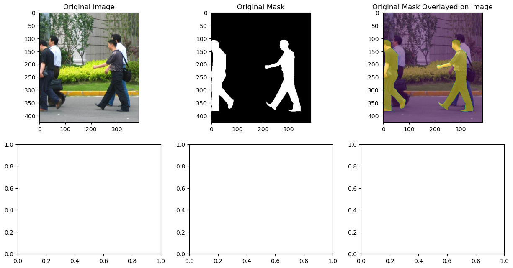
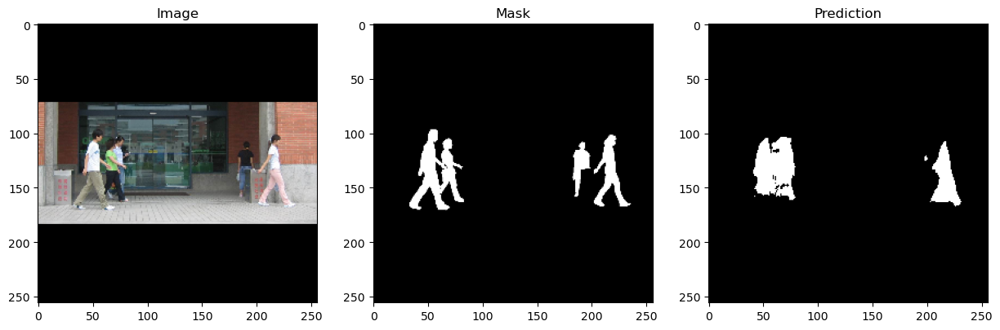
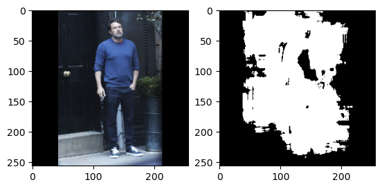
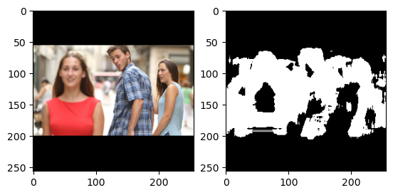
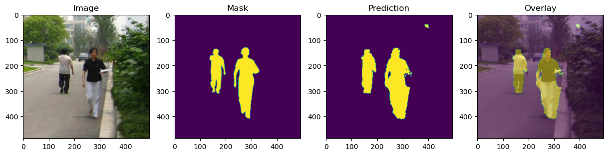
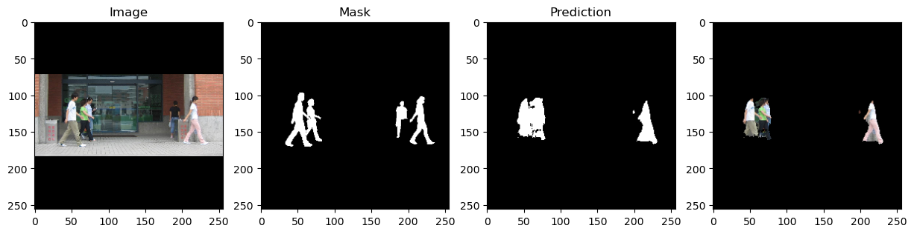
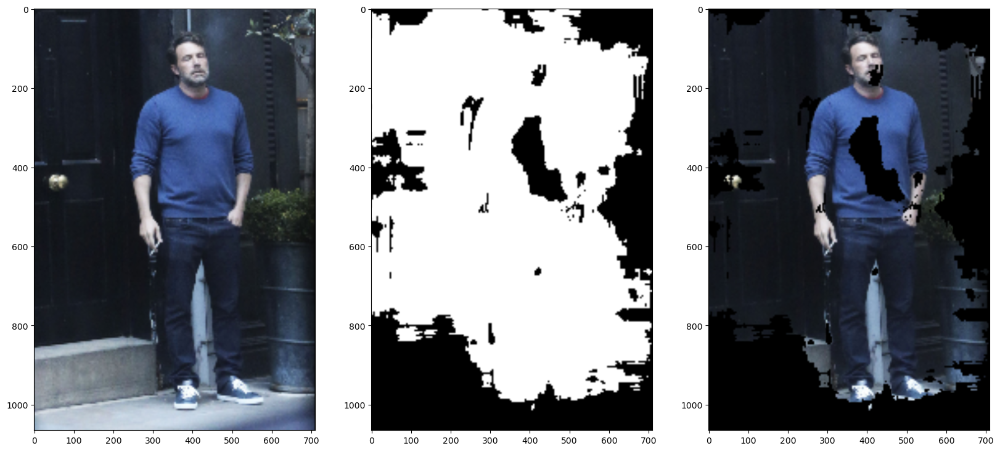
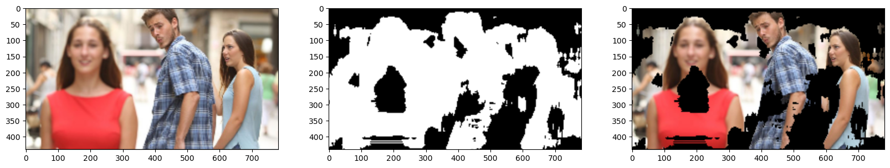
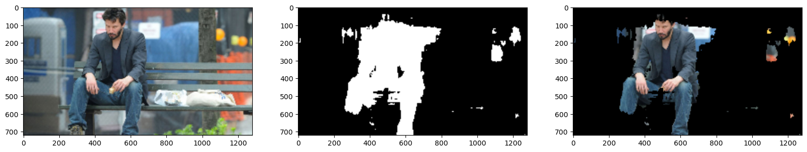

# Computer Assignment 4: CNN Segmentation
## Alaqian Zafar - aaz7118

## Table of Contents
- <a href='#p1a'>Part (a)</a>
- <a href='#p1b'>Part (b)</a>
- <a href='#p1c'>Part (c)</a>
    - [Architecture](#Architecture)
    - [Loss Function](#Loss-Function)
- <a href='#p1d'>Part (d)</a>
- <a href='#p2a'>Part (e)</a>
- <a href='#p2b'>Part (f)</a>
- <a href='#p2c'>Part (g)</a>


```python
import os
import random

import cv2
import matplotlib.pyplot as plt
import numpy as np
import torch
import torch.nn as nn
from torch.utils.data import DataLoader
from torch.utils.data import Dataset
from torchvision import transforms
from tqdm import tqdm

%matplotlib inline
```


```python
try:
    from google.colab import drive
    drive.mount('/content/drive')
    path = '/content/drive/MyDrive/ECE-GY 6123 Image and Video Processing/Computer Assignments/CA04/archive'
except:
    path = 'archive'
```

<a id='p1a'></a>
##### (a) Cut the FudanPed dataset into an 80-10-10 train-val-test split.

[Table of Contents](#Table-of-Contents)


```python
image_paths = sorted([os.path.join(path, "PNGImages", image) for image in os.listdir(os.path.join(path, "PNGImages"))])
mask_paths = sorted([os.path.join(path, "PedMasks", mask) for mask in os.listdir(os.path.join(path, "PedMasks"))])

indices = list(range(len(image_paths)))
train_indices = random.sample(indices, k=int(len(indices)*0.8))
val_indices = random.sample(set(indices)-set(train_indices), k=int(len(indices)*0.1))
test_indices = list(set(indices)-set(train_indices)-set(val_indices))

train_image_paths = [image_paths[i] for i in train_indices]
train_mask_paths = [mask_paths[i] for i in train_indices]
val_image_paths = [image_paths[i] for i in val_indices]
val_mask_paths = [mask_paths[i] for i in val_indices]
test_image_paths = [image_paths[i] for i in test_indices]
test_mask_paths = [mask_paths[i] for i in test_indices]

def square_pad(image):
    h_diff = max(image.shape) - image.shape[0]
    w_diff = max(image.shape) - image.shape[1]

    top = (h_diff + 1) // 2 if h_diff % 2 == 1 else h_diff // 2
    bottom = h_diff // 2
    left = (w_diff + 1) // 2 if w_diff % 2 == 1 else w_diff // 2    
    right = w_diff // 2
    padded_image = cv2.copyMakeBorder(image, top, bottom, left, right, cv2.BORDER_CONSTANT, value=0)
    return padded_image, image.shape

def remove_pad(padded_image, original_shape):
    padded_image = cv2.resize(padded_image, (max(original_shape), max(original_shape)))
    h_diff = padded_image.shape[0] - original_shape[0]
    w_diff = padded_image.shape[1] - original_shape[1]

    h_start = (h_diff + 1) // 2 if h_diff % 2 == 1 else h_diff // 2
    h_end = padded_image.shape[0] - h_diff // 2
    w_start = (w_diff + 1) // 2 if w_diff % 2 == 1 else w_diff // 2
    w_end = padded_image.shape[1] - w_diff // 2

    return padded_image[h_start:h_end, w_start:w_end]

class PennFudanDataset(Dataset):
    def __init__(self, image_paths, mask_paths, image_size=None, transform=None):
        self.image_paths = image_paths
        self.mask_paths = mask_paths
        self.image_size = image_size
        self.transform = transform

    def __len__(self):
        return len(self.image_paths)

    def __getitem__(self, idx):
        image = cv2.imread(self.image_paths[idx])
        image = cv2.cvtColor(image, cv2.COLOR_BGR2RGB)
        mask = cv2.imread(self.mask_paths[idx], 0)
        # Set all values greater-than or equal-to 1 to 255.
        mask = np.clip(mask, 0, 1)*255
        if self.transform or self.image_size:
            merged_image = np.concatenate((image, mask[:, :, None]), axis=2)
            merged_image, merged_shape = square_pad(merged_image)
            merged_image = transforms.ToTensor()(merged_image)
            if self.transform:
                merged_image = self.transform(merged_image)
            if self.image_size:
                merged_image = transforms.Resize((self.image_size, self.image_size))(merged_image)
            image = merged_image[:3, :, :]
            mask = merged_image[3, :, :].unsqueeze(0)
            return image, mask, merged_shape
        else:
            image = transforms.ToTensor()(image)
            mask = transforms.ToTensor()(mask)
        return image, mask
```

    C:\Users\Alqia\AppData\Local\Temp\ipykernel_24588\1373736281.py:6: DeprecationWarning: Sampling from a set deprecated
    since Python 3.9 and will be removed in a subsequent version.
      val_indices = random.sample(set(indices)-set(train_indices), k=int(len(indices)*0.1))
    

<a id='p1b'></a>
##### (b) Apply data augmentation to your dataset during training and show an example of your data augmentation in your report.

[Table of Contents](#Table-of-Contents)


```python
# Plot a subplot of the original and the augmented image and mask
train_dataset = PennFudanDataset(train_image_paths, train_mask_paths)
image, mask = train_dataset[0]
fig, ax = plt.subplots(2, 3, figsize=(15, 7.5))
ax[0,0].imshow(image.permute(1, 2, 0))
ax[0,0].set_title("Original Image")
ax[0,1].imshow(mask.squeeze(), cmap="gray")
ax[0,1].set_title("Original Mask")
ax[0,2].imshow(image.permute(1, 2, 0))
ax[0,2].imshow(mask.squeeze(), alpha=0.5)
ax[0,2].set_title("Original Mask Overlayed on Image")

image_size = 256

augmentation = transforms.Compose([
    transforms.RandomHorizontalFlip(),
    transforms.RandomResizedCrop(size=image_size,scale=(0.35, 1.0), ratio=(1.0, 1.0))])
augmented_train_dataset = PennFudanDataset(
    train_image_paths, 
    train_mask_paths,
    transform=augmentation)
image, mask, _ = augmented_train_dataset[0]
ax[1,0].imshow(image.permute(1, 2, 0))
ax[1,0].set_title("Augmented Image")
ax[1,1].imshow(mask.squeeze(),cmap="gray")
ax[1,1].set_title("Augmented Mask")
ax[1,2].imshow(image.permute(1, 2, 0))
ax[1,2].imshow(mask.squeeze(), alpha=0.5)
ax[1,2].set_title("Original Mask Overlayed on Image")

batchsize = 8

test_dataset = PennFudanDataset(test_image_paths, test_mask_paths, image_size=image_size)

val_dataset = PennFudanDataset(val_image_paths, val_mask_paths, image_size=image_size)
```

    c:\Users\Alqia\miniconda3\envs\torch\lib\site-packages\torchvision\transforms\functional.py:1603: UserWarning: The default value of the antialias parameter of all the resizing transforms (Resize(), RandomResizedCrop(), etc.) will change from None to True in v0.17, in order to be consistent across the PIL and Tensor backends. To suppress this warning, directly pass antialias=True (recommended, future default), antialias=None (current default, which means False for Tensors and True for PIL), or antialias=False (only works on Tensors - PIL will still use antialiasing). This also applies if you are using the inference transforms from the models weights: update the call to weights.transforms(antialias=True).
      warnings.warn(
    


    

    


<a id='p1c'></a>
##### (c) Implement and train a CNN for binary segmentation on your train split. Describe your network architecture, loss function, and any training hyper-parameters. You may implement any architecture you'd like, **but the implementation must be your own code.**

[Table of Contents](#Table-of-Contents)

#### Architecture

`x` (input) → `Conv_BN_ReLU1` → `Downsample1` → `x1` → `x2` → `Conv_BN_ReLU2` → `x3` → `Downsample2` → `x4` → `Conv_BN_ReLU3` → `x5` → `Upsample1` → `x6` → `cat(x3)` → `x7` → `Conv_BN_ReLU4` → `x8` → `Upsamle2` → `x9` → `cat(x1)` → `x10` → `Conv_BN_ReLU5` → `x11` → `conv6` → `x12` → `sigmoid` → `x13` (output)


```python
class UNET(nn.Module):
    def __init__(self):
        super(UNET, self).__init__()
        self.Conv_BN_ReLU1 = self._Conv_BN_ReLU(3, 16)
        self.Downsample1 = nn.MaxPool2d(kernel_size=2, stride=2)
        self.Conv_BN_ReLU2 = self._Conv_BN_ReLU(16, 32)
        self.Downsample2 = nn.MaxPool2d(kernel_size=2, stride=2)
        self.Conv_BN_ReLU3 = self._Conv_BN_ReLU(32, 32)
        self.Upsample1 = nn.Upsample(scale_factor=2, mode="bilinear", align_corners=True)
        self.Conv_BN_ReLU4 = self._Conv_BN_ReLU(64, 16)
        self.Upsample2 = nn.Upsample(scale_factor=2, mode="bilinear", align_corners=True)
        self.Conv_BN_ReLU5 = self._Conv_BN_ReLU(32, 16)
        self.Conv6 = nn.Conv2d(16, 1, kernel_size=1)

    def _Conv_BN_ReLU(self, in_channels, out_channels):
        return nn.Sequential(
            nn.Conv2d(in_channels, out_channels, kernel_size=3, padding='same'),
            nn.BatchNorm2d(out_channels),
            nn.ReLU(inplace=True),
            nn.Conv2d(out_channels, out_channels, kernel_size=3, padding='same'),
            nn.BatchNorm2d(out_channels),
            nn.ReLU(inplace=True)
        )
    
    def forward(self, x):
        x1 = self.Conv_BN_ReLU1(x) # 3x128x128 -> 16x128x128
        x2 = self.Downsample1(x1) # 16x128x128 -> 16x64x64
        x3 = self.Conv_BN_ReLU2(x2) # 16x64x64 -> 32x64x64
        x4 = self.Downsample2(x3) # 32x64x64 -> 32x32x32
        x5 = self.Conv_BN_ReLU3(x4) # 32x32x32 -> 32x32x32
        x6 = self.Upsample1(x5) # 32x32x32 -> 32x64x64
        x7 = torch.cat((x6, x3), dim=1) # 32x64x64 + 32x64x64 -> 64x64x64
        x8 = self.Conv_BN_ReLU4(x7) # 64x64x64 -> 16x64x64
        x9 = self.Upsample2(x8) # 16x64x64 -> 16x128x128
        x10 = torch.cat((x9, x1), dim=1) # 16x128x128 + 16x128x128 -> 32x128x128
        x11 = self.Conv_BN_ReLU5(x10) # 32x128x128 -> 16x128x128
        x12 = self.Conv6(x11) # 16x128x128 -> 1x128x128
        x13 = torch.sigmoid(x12) # 1x128x128 -> 1x128x128
        return x13
```

#### Loss Function

[Table of Contents](#Table-of-Contents)


```python
def dice_coefficient(output, ground_truth):
    numerical_stability = 1.
    output = output.view(-1)
    ground_truth = ground_truth.view(-1)
    intersection = (output * ground_truth).sum()
    return (2. * intersection + numerical_stability) / (output.sum() + ground_truth.sum() + numerical_stability)

class SoftDiceLoss(nn.Module):
    def __init__(self):
        super(SoftDiceLoss, self).__init__()
    
    def forward(self, output, ground_truth):
        return 1 - dice_coefficient(output, ground_truth)
```

#### Training and Evaluation Functions

[Table of Contents](#Table-of-Contents)


```python
def train(model, train_loader, optimizer, criterion, device):
    model.train()
    train_loss = 0
    for image, mask, _ in train_loader:
        image = image.to(device)
        mask = mask.to(device)
        optimizer.zero_grad()
        pred = (model(image))
        loss = criterion(pred, mask)
        loss.backward()
        optimizer.step()
        train_loss += loss.item()
    return train_loss / len(train_loader)

def evaluate(model, val_loader, criterion, device):
    model.eval()
    val_loss = 0
    with torch.no_grad():
        for image, mask, _ in val_loader:
            image = image.to(device)
            mask = mask.to(device)
            pred = torch.round(model(image))
            loss = criterion(pred, mask)
            val_loss += loss.item()
    return val_loss / len(val_loader)
```

#### Saving and Loading Checkpoint Functions

[Table of Contents](#Table-of-Contents)


```python
def save_checkpoint(filename, model, optimizer, epoch, val_loss):
    torch.save({
        "model": model.state_dict(),
        "optimizer": optimizer.state_dict(),
        "epoch": epoch,
        "loss": val_loss}, 
        filename)
    print(
            "Checkpoint saved:",
            "Epoch: {}".format(epoch),
            "Validation Loss: {:.4f}".format(val_loss),
            "Learning Rate: {:.3e}".format(optimizer.param_groups[0]["lr"]),
            sep="\t")
    
def load_checkpoint(filename, model, optimizer):
    checkpoint = torch.load(filename)
    model.load_state_dict(checkpoint["model"])
    optimizer.load_state_dict(checkpoint["optimizer"])
    epoch = checkpoint["epoch"]
    loss = checkpoint["loss"]
    print(
        "Checkpoint loaded:",
        "Epoch: {}".format(epoch),
        "Validation Loss: {:.4f}".format(loss),
        "Learning Rate: {:.3e}".format(optimizer.param_groups[0]["lr"]),
        sep="\t")
    return model, optimizer, epoch, loss
```

#### Training Hyperparameters

[Table of Contents](#Table-of-Contents)


```python
NUM_EPOCHS = 100
learning_rate=0.001
batchsize=8

device = torch.device("cuda:0" if torch.cuda.is_available() else "cpu")
checkpoint_dir = "./checkpoints"
checkpoint_path = os.path.join(checkpoint_dir, "checkpoint.pth")
!del "checkpoints\checkpoint.pth"
criterion = SoftDiceLoss()#nn.BCELoss()#
model = UNET().to(device)
optimizer = torch.optim.Adam(model.parameters(), lr=learning_rate)
scheduler = torch.optim.lr_scheduler.ReduceLROnPlateau(optimizer, patience=20, verbose=True)

train_losses = []
val_losses = []
val_loader = DataLoader(test_dataset, batch_size=batchsize, shuffle=False)
train_loader = DataLoader(augmented_train_dataset, batch_size=batchsize, shuffle=True)
```

#### Training for 100 Epochs at 0.001 Learning Rate

[Table of Contents](#Table-of-Contents)


```python
if os.path.exists(checkpoint_path):
    model, optimizer, epoch, val_loss = load_checkpoint(checkpoint_path, model, optimizer)
    train_losses = train_losses[:epoch]
    val_losses = val_losses[:epoch]
else:
    epoch = 0
    val_loss = np.inf
    train_loss = np.inf
count = 0

while epoch < NUM_EPOCHS:
    epoch += 1
    progress_bar = tqdm(
        train_loader, 
        desc="Epoch {}".format(epoch),
        ncols=85,
        unit=" batches")
    train_loss = train(model, progress_bar, optimizer, criterion, device)
    val_loss = evaluate(model, val_loader, criterion, device)
    train_losses.append(train_loss)
    val_losses.append(val_loss)
    if val_loss == np.min(val_losses):
        save_checkpoint(checkpoint_path, model, optimizer, epoch, val_loss)
        count = 0
    else:
        count += 1
        if count == 5:
            print(
                "Training Progress:",
                "Train Loss: {:.4f}".format(train_loss),
                "Val Loss: {:.4f}".format(val_loss),
                sep="\t")
            count = 0
```

    Epoch 1: 100%|█████████████████████████████████| 17/17 [00:07<00:00,  2.35 batches/s]
    

    Checkpoint saved:	Epoch: 1	Validation Loss: 0.7798	Learning Rate: 1.000e-03
    

    Epoch 2: 100%|█████████████████████████████████| 17/17 [00:03<00:00,  4.27 batches/s]
    

    Checkpoint saved:	Epoch: 2	Validation Loss: 0.7067	Learning Rate: 1.000e-03
    

    Epoch 3: 100%|█████████████████████████████████| 17/17 [00:03<00:00,  4.47 batches/s]
    

    Checkpoint saved:	Epoch: 3	Validation Loss: 0.7002	Learning Rate: 1.000e-03
    

    Epoch 4: 100%|█████████████████████████████████| 17/17 [00:03<00:00,  4.28 batches/s]
    

    Checkpoint saved:	Epoch: 4	Validation Loss: 0.5169	Learning Rate: 1.000e-03
    

    Epoch 5: 100%|█████████████████████████████████| 17/17 [00:03<00:00,  4.33 batches/s]
    Epoch 6: 100%|█████████████████████████████████| 17/17 [00:03<00:00,  4.62 batches/s]
    Epoch 7: 100%|█████████████████████████████████| 17/17 [00:03<00:00,  4.73 batches/s]
    

    Checkpoint saved:	Epoch: 7	Validation Loss: 0.5079	Learning Rate: 1.000e-03
    

    Epoch 8: 100%|█████████████████████████████████| 17/17 [00:03<00:00,  4.45 batches/s]
    

    Checkpoint saved:	Epoch: 8	Validation Loss: 0.3750	Learning Rate: 1.000e-03
    

    Epoch 9: 100%|█████████████████████████████████| 17/17 [00:03<00:00,  4.66 batches/s]
    Epoch 10: 100%|████████████████████████████████| 17/17 [00:04<00:00,  4.14 batches/s]
    Epoch 11: 100%|████████████████████████████████| 17/17 [00:04<00:00,  4.24 batches/s]
    Epoch 12: 100%|████████████████████████████████| 17/17 [00:03<00:00,  4.79 batches/s]
    Epoch 13: 100%|████████████████████████████████| 17/17 [00:03<00:00,  4.89 batches/s]
    

    Training Progress:	Train Loss: 0.3781	Val Loss: 0.4415
    

    Epoch 14: 100%|████████████████████████████████| 17/17 [00:03<00:00,  4.70 batches/s]
    Epoch 15: 100%|████████████████████████████████| 17/17 [00:03<00:00,  4.49 batches/s]
    

    Checkpoint saved:	Epoch: 15	Validation Loss: 0.3108	Learning Rate: 1.000e-03
    

    Epoch 16: 100%|████████████████████████████████| 17/17 [00:03<00:00,  4.50 batches/s]
    Epoch 17: 100%|████████████████████████████████| 17/17 [00:03<00:00,  4.42 batches/s]
    Epoch 18: 100%|████████████████████████████████| 17/17 [00:03<00:00,  4.64 batches/s]
    Epoch 19: 100%|████████████████████████████████| 17/17 [00:03<00:00,  4.30 batches/s]
    Epoch 20: 100%|████████████████████████████████| 17/17 [00:03<00:00,  4.64 batches/s]
    

    Training Progress:	Train Loss: 0.3402	Val Loss: 0.3647
    

    Epoch 21: 100%|████████████████████████████████| 17/17 [00:04<00:00,  4.24 batches/s]
    Epoch 22: 100%|████████████████████████████████| 17/17 [00:03<00:00,  4.58 batches/s]
    Epoch 23: 100%|████████████████████████████████| 17/17 [00:03<00:00,  4.36 batches/s]
    Epoch 24: 100%|████████████████████████████████| 17/17 [00:03<00:00,  4.52 batches/s]
    Epoch 25: 100%|████████████████████████████████| 17/17 [00:03<00:00,  4.60 batches/s]
    

    Training Progress:	Train Loss: 0.3073	Val Loss: 0.4557
    

    Epoch 26: 100%|████████████████████████████████| 17/17 [00:04<00:00,  4.13 batches/s]
    Epoch 27: 100%|████████████████████████████████| 17/17 [00:03<00:00,  4.72 batches/s]
    Epoch 28: 100%|████████████████████████████████| 17/17 [00:03<00:00,  4.46 batches/s]
    Epoch 29: 100%|████████████████████████████████| 17/17 [00:03<00:00,  4.43 batches/s]
    

    Checkpoint saved:	Epoch: 29	Validation Loss: 0.3101	Learning Rate: 1.000e-03
    

    Epoch 30: 100%|████████████████████████████████| 17/17 [00:03<00:00,  4.43 batches/s]
    Epoch 31: 100%|████████████████████████████████| 17/17 [00:03<00:00,  4.26 batches/s]
    Epoch 32: 100%|████████████████████████████████| 17/17 [00:03<00:00,  4.51 batches/s]
    Epoch 33: 100%|████████████████████████████████| 17/17 [00:03<00:00,  4.81 batches/s]
    Epoch 34: 100%|████████████████████████████████| 17/17 [00:03<00:00,  4.48 batches/s]
    

    Checkpoint saved:	Epoch: 34	Validation Loss: 0.2597	Learning Rate: 1.000e-03
    

    Epoch 35: 100%|████████████████████████████████| 17/17 [00:04<00:00,  4.20 batches/s]
    Epoch 36: 100%|████████████████████████████████| 17/17 [00:04<00:00,  3.96 batches/s]
    

    Checkpoint saved:	Epoch: 36	Validation Loss: 0.2582	Learning Rate: 1.000e-03
    

    Epoch 37: 100%|████████████████████████████████| 17/17 [00:03<00:00,  4.50 batches/s]
    

    Checkpoint saved:	Epoch: 37	Validation Loss: 0.2367	Learning Rate: 1.000e-03
    

    Epoch 38: 100%|████████████████████████████████| 17/17 [00:03<00:00,  4.39 batches/s]
    Epoch 39: 100%|████████████████████████████████| 17/17 [00:03<00:00,  4.30 batches/s]
    Epoch 40: 100%|████████████████████████████████| 17/17 [00:03<00:00,  4.50 batches/s]
    Epoch 41: 100%|████████████████████████████████| 17/17 [00:03<00:00,  4.48 batches/s]
    Epoch 42: 100%|████████████████████████████████| 17/17 [00:03<00:00,  4.54 batches/s]
    

    Training Progress:	Train Loss: 0.2764	Val Loss: 0.3286
    

    Epoch 43: 100%|████████████████████████████████| 17/17 [00:03<00:00,  4.84 batches/s]
    Epoch 44: 100%|████████████████████████████████| 17/17 [00:03<00:00,  4.76 batches/s]
    Epoch 45: 100%|████████████████████████████████| 17/17 [00:03<00:00,  4.39 batches/s]
    Epoch 46: 100%|████████████████████████████████| 17/17 [00:03<00:00,  4.52 batches/s]
    Epoch 47: 100%|████████████████████████████████| 17/17 [00:03<00:00,  4.83 batches/s]
    

    Training Progress:	Train Loss: 0.2364	Val Loss: 0.4652
    

    Epoch 48: 100%|████████████████████████████████| 17/17 [00:03<00:00,  4.44 batches/s]
    Epoch 49: 100%|████████████████████████████████| 17/17 [00:03<00:00,  4.49 batches/s]
    Epoch 50: 100%|████████████████████████████████| 17/17 [00:03<00:00,  4.81 batches/s]
    Epoch 51: 100%|████████████████████████████████| 17/17 [00:03<00:00,  4.38 batches/s]
    

    Checkpoint saved:	Epoch: 51	Validation Loss: 0.1972	Learning Rate: 1.000e-03
    

    Epoch 52: 100%|████████████████████████████████| 17/17 [00:03<00:00,  4.37 batches/s]
    Epoch 53: 100%|████████████████████████████████| 17/17 [00:04<00:00,  4.23 batches/s]
    Epoch 54: 100%|████████████████████████████████| 17/17 [00:03<00:00,  4.50 batches/s]
    Epoch 55: 100%|████████████████████████████████| 17/17 [00:03<00:00,  4.60 batches/s]
    Epoch 56: 100%|████████████████████████████████| 17/17 [00:03<00:00,  4.77 batches/s]
    

    Training Progress:	Train Loss: 0.2372	Val Loss: 0.2739
    

    Epoch 57: 100%|████████████████████████████████| 17/17 [00:03<00:00,  4.47 batches/s]
    Epoch 58: 100%|████████████████████████████████| 17/17 [00:03<00:00,  4.37 batches/s]
    Epoch 59: 100%|████████████████████████████████| 17/17 [00:03<00:00,  4.52 batches/s]
    Epoch 60: 100%|████████████████████████████████| 17/17 [00:03<00:00,  4.69 batches/s]
    Epoch 61: 100%|████████████████████████████████| 17/17 [00:04<00:00,  4.22 batches/s]
    

    Training Progress:	Train Loss: 0.2368	Val Loss: 0.2031
    

    Epoch 62: 100%|████████████████████████████████| 17/17 [00:03<00:00,  4.38 batches/s]
    Epoch 63: 100%|████████████████████████████████| 17/17 [00:03<00:00,  4.90 batches/s]
    Epoch 64: 100%|████████████████████████████████| 17/17 [00:03<00:00,  4.52 batches/s]
    Epoch 65: 100%|████████████████████████████████| 17/17 [00:03<00:00,  4.46 batches/s]
    Epoch 66: 100%|████████████████████████████████| 17/17 [00:03<00:00,  4.72 batches/s]
    

    Training Progress:	Train Loss: 0.2390	Val Loss: 0.2357
    

    Epoch 67: 100%|████████████████████████████████| 17/17 [00:03<00:00,  4.55 batches/s]
    Epoch 68: 100%|████████████████████████████████| 17/17 [00:03<00:00,  4.29 batches/s]
    Epoch 69: 100%|████████████████████████████████| 17/17 [00:03<00:00,  4.54 batches/s]
    Epoch 70: 100%|████████████████████████████████| 17/17 [00:03<00:00,  4.46 batches/s]
    Epoch 71: 100%|████████████████████████████████| 17/17 [00:04<00:00,  4.19 batches/s]
    

    Training Progress:	Train Loss: 0.2258	Val Loss: 0.2665
    

    Epoch 72: 100%|████████████████████████████████| 17/17 [00:03<00:00,  4.59 batches/s]
    Epoch 73: 100%|████████████████████████████████| 17/17 [00:03<00:00,  4.49 batches/s]
    Epoch 74: 100%|████████████████████████████████| 17/17 [00:03<00:00,  4.62 batches/s]
    Epoch 75: 100%|████████████████████████████████| 17/17 [00:03<00:00,  5.01 batches/s]
    Epoch 76: 100%|████████████████████████████████| 17/17 [00:03<00:00,  4.39 batches/s]
    

    Training Progress:	Train Loss: 0.2107	Val Loss: 0.3702
    

    Epoch 77: 100%|████████████████████████████████| 17/17 [00:03<00:00,  4.67 batches/s]
    Epoch 78: 100%|████████████████████████████████| 17/17 [00:03<00:00,  4.74 batches/s]
    Epoch 79: 100%|████████████████████████████████| 17/17 [00:03<00:00,  4.25 batches/s]
    Epoch 80: 100%|████████████████████████████████| 17/17 [00:03<00:00,  4.71 batches/s]
    

    Checkpoint saved:	Epoch: 80	Validation Loss: 0.1927	Learning Rate: 1.000e-03
    

    Epoch 81: 100%|████████████████████████████████| 17/17 [00:03<00:00,  4.42 batches/s]
    Epoch 82: 100%|████████████████████████████████| 17/17 [00:03<00:00,  4.66 batches/s]
    Epoch 83: 100%|████████████████████████████████| 17/17 [00:03<00:00,  4.46 batches/s]
    Epoch 84: 100%|████████████████████████████████| 17/17 [00:03<00:00,  4.51 batches/s]
    Epoch 85: 100%|████████████████████████████████| 17/17 [00:03<00:00,  4.84 batches/s]
    

    Training Progress:	Train Loss: 0.2135	Val Loss: 0.2280
    

    Epoch 86: 100%|████████████████████████████████| 17/17 [00:03<00:00,  4.47 batches/s]
    Epoch 87: 100%|████████████████████████████████| 17/17 [00:03<00:00,  4.79 batches/s]
    

    Checkpoint saved:	Epoch: 87	Validation Loss: 0.1841	Learning Rate: 1.000e-03
    

    Epoch 88: 100%|████████████████████████████████| 17/17 [00:03<00:00,  4.56 batches/s]
    

    Checkpoint saved:	Epoch: 88	Validation Loss: 0.1763	Learning Rate: 1.000e-03
    

    Epoch 89: 100%|████████████████████████████████| 17/17 [00:04<00:00,  4.08 batches/s]
    

    Checkpoint saved:	Epoch: 89	Validation Loss: 0.1751	Learning Rate: 1.000e-03
    

    Epoch 90: 100%|████████████████████████████████| 17/17 [00:03<00:00,  4.81 batches/s]
    Epoch 91: 100%|████████████████████████████████| 17/17 [00:03<00:00,  4.56 batches/s]
    Epoch 92: 100%|████████████████████████████████| 17/17 [00:03<00:00,  4.51 batches/s]
    Epoch 93: 100%|████████████████████████████████| 17/17 [00:03<00:00,  4.45 batches/s]
    Epoch 94: 100%|████████████████████████████████| 17/17 [00:03<00:00,  5.03 batches/s]
    

    Training Progress:	Train Loss: 0.1984	Val Loss: 0.2950
    

    Epoch 95: 100%|████████████████████████████████| 17/17 [00:03<00:00,  4.27 batches/s]
    Epoch 96: 100%|████████████████████████████████| 17/17 [00:03<00:00,  4.48 batches/s]
    Epoch 97: 100%|████████████████████████████████| 17/17 [00:03<00:00,  4.62 batches/s]
    Epoch 98: 100%|████████████████████████████████| 17/17 [00:03<00:00,  4.54 batches/s]
    Epoch 99: 100%|████████████████████████████████| 17/17 [00:03<00:00,  4.55 batches/s]
    

    Training Progress:	Train Loss: 0.2027	Val Loss: 0.2310
    

    Epoch 100: 100%|███████████████████████████████| 17/17 [00:03<00:00,  4.88 batches/s]
    

#### Training with a Learning Rate Scheduler

[Table of Contents](#Table-of-Contents)


```python
if os.path.exists(checkpoint_path):
    model, optimizer, epoch, val_loss = load_checkpoint(checkpoint_path, model, optimizer)
    train_losses = train_losses[:epoch]
    val_losses = val_losses[:epoch]
else:
    epoch = 0
    val_loss = np.inf
    train_loss = np.inf
count = 0
while optimizer.param_groups[0]['lr'] > 1e-7 and val_loss > 0.1:
    epoch += 1
    progress_bar = tqdm(
        train_loader, 
        desc="Epoch {}".format(epoch),
        ncols=85,
        unit=" batches")
    train_loss = train(model, progress_bar, optimizer, criterion, device)
    val_loss = evaluate(model, val_loader, criterion, device)
    scheduler.step(val_loss)
    train_losses.append(train_loss)
    val_losses.append(val_loss)
    if val_loss == np.min(val_losses):
        save_checkpoint(checkpoint_path, model, optimizer, epoch, val_loss)
        count = 0
    else:
        count += 1
        if count == 5:
            print(
                "Training Progress:",
                "Epoch: {}".format(epoch),
                "Train Loss: {:.4f}".format(train_loss),
                "Val Loss: {:.4f}".format(val_loss),
                "Learning Rate = {:.1e}".format(optimizer.param_groups[0]["lr"]),
                sep="\t")
            count = 0
```

    Checkpoint loaded:	Epoch: 187	Validation Loss: 0.1421	Learning Rate: 1.000e-04
    

    Epoch 188: 100%|███████████████████████████████| 17/17 [00:03<00:00,  4.31 batches/s]
    Epoch 189: 100%|███████████████████████████████| 17/17 [00:03<00:00,  4.45 batches/s]
    Epoch 190: 100%|███████████████████████████████| 17/17 [00:04<00:00,  4.11 batches/s]
    

    Epoch 00183: reducing learning rate of group 0 to 1.0000e-05.
    

    Epoch 191: 100%|███████████████████████████████| 17/17 [00:04<00:00,  4.04 batches/s]
    Epoch 192: 100%|███████████████████████████████| 17/17 [00:03<00:00,  4.33 batches/s]
    

    Training Progress:	Epoch: 192	Train Loss: 0.1541	Val Loss: 0.1562	Learning Rate = 1.0e-05
    

    Epoch 193: 100%|███████████████████████████████| 17/17 [00:04<00:00,  4.16 batches/s]
    Epoch 194: 100%|███████████████████████████████| 17/17 [00:04<00:00,  4.06 batches/s]
    Epoch 195: 100%|███████████████████████████████| 17/17 [00:03<00:00,  4.29 batches/s]
    Epoch 196: 100%|███████████████████████████████| 17/17 [00:04<00:00,  4.12 batches/s]
    Epoch 197: 100%|███████████████████████████████| 17/17 [00:04<00:00,  4.10 batches/s]
    

    Training Progress:	Epoch: 197	Train Loss: 0.1498	Val Loss: 0.1551	Learning Rate = 1.0e-05
    

    Epoch 198: 100%|███████████████████████████████| 17/17 [00:04<00:00,  4.22 batches/s]
    Epoch 199: 100%|███████████████████████████████| 17/17 [00:03<00:00,  4.33 batches/s]
    Epoch 200: 100%|███████████████████████████████| 17/17 [00:04<00:00,  4.07 batches/s]
    Epoch 201: 100%|███████████████████████████████| 17/17 [00:03<00:00,  4.33 batches/s]
    Epoch 202: 100%|███████████████████████████████| 17/17 [00:04<00:00,  4.13 batches/s]
    

    Training Progress:	Epoch: 202	Train Loss: 0.1493	Val Loss: 0.1557	Learning Rate = 1.0e-05
    

    Epoch 203: 100%|███████████████████████████████| 17/17 [00:04<00:00,  4.00 batches/s]
    Epoch 204: 100%|███████████████████████████████| 17/17 [00:04<00:00,  3.99 batches/s]
    Epoch 205: 100%|███████████████████████████████| 17/17 [00:04<00:00,  4.24 batches/s]
    Epoch 206: 100%|███████████████████████████████| 17/17 [00:04<00:00,  4.01 batches/s]
    Epoch 207: 100%|███████████████████████████████| 17/17 [00:04<00:00,  4.08 batches/s]
    

    Training Progress:	Epoch: 207	Train Loss: 0.1513	Val Loss: 0.1507	Learning Rate = 1.0e-05
    

    Epoch 208: 100%|███████████████████████████████| 17/17 [00:04<00:00,  4.22 batches/s]
    Epoch 209: 100%|███████████████████████████████| 17/17 [00:04<00:00,  4.05 batches/s]
    Epoch 210: 100%|███████████████████████████████| 17/17 [00:04<00:00,  4.12 batches/s]
    Epoch 211: 100%|███████████████████████████████| 17/17 [00:03<00:00,  4.39 batches/s]
    

    Epoch 00204: reducing learning rate of group 0 to 1.0000e-06.
    

    Epoch 212: 100%|███████████████████████████████| 17/17 [00:04<00:00,  4.09 batches/s]
    

    Training Progress:	Epoch: 212	Train Loss: 0.1513	Val Loss: 0.1590	Learning Rate = 1.0e-06
    

    Epoch 213: 100%|███████████████████████████████| 17/17 [00:04<00:00,  4.04 batches/s]
    Epoch 214: 100%|███████████████████████████████| 17/17 [00:03<00:00,  4.28 batches/s]
    Epoch 215: 100%|███████████████████████████████| 17/17 [00:04<00:00,  4.20 batches/s]
    Epoch 216: 100%|███████████████████████████████| 17/17 [00:04<00:00,  4.02 batches/s]
    Epoch 217: 100%|███████████████████████████████| 17/17 [00:03<00:00,  4.25 batches/s]
    

    Training Progress:	Epoch: 217	Train Loss: 0.1494	Val Loss: 0.1569	Learning Rate = 1.0e-06
    

    Epoch 218: 100%|███████████████████████████████| 17/17 [00:04<00:00,  3.95 batches/s]
    Epoch 219: 100%|███████████████████████████████| 17/17 [00:03<00:00,  4.32 batches/s]
    Epoch 220: 100%|███████████████████████████████| 17/17 [00:03<00:00,  4.41 batches/s]
    Epoch 221: 100%|███████████████████████████████| 17/17 [00:04<00:00,  4.22 batches/s]
    Epoch 222: 100%|███████████████████████████████| 17/17 [00:04<00:00,  4.15 batches/s]
    

    Training Progress:	Epoch: 222	Train Loss: 0.1524	Val Loss: 0.1613	Learning Rate = 1.0e-06
    

    Epoch 223: 100%|███████████████████████████████| 17/17 [00:03<00:00,  4.37 batches/s]
    Epoch 224: 100%|███████████████████████████████| 17/17 [00:04<00:00,  3.95 batches/s]
    Epoch 225: 100%|███████████████████████████████| 17/17 [00:04<00:00,  4.10 batches/s]
    Epoch 226: 100%|███████████████████████████████| 17/17 [00:04<00:00,  4.12 batches/s]
    Epoch 227: 100%|███████████████████████████████| 17/17 [00:04<00:00,  4.15 batches/s]
    

    Training Progress:	Epoch: 227	Train Loss: 0.1540	Val Loss: 0.1617	Learning Rate = 1.0e-06
    

    Epoch 228: 100%|███████████████████████████████| 17/17 [00:04<00:00,  4.10 batches/s]
    Epoch 229: 100%|███████████████████████████████| 17/17 [00:03<00:00,  4.30 batches/s]
    Epoch 230: 100%|███████████████████████████████| 17/17 [00:04<00:00,  4.10 batches/s]
    Epoch 231: 100%|███████████████████████████████| 17/17 [00:04<00:00,  4.15 batches/s]
    Epoch 232: 100%|███████████████████████████████| 17/17 [00:03<00:00,  4.38 batches/s]
    

    Epoch 00225: reducing learning rate of group 0 to 1.0000e-07.
    Training Progress:	Epoch: 232	Train Loss: 0.1474	Val Loss: 0.1565	Learning Rate = 1.0e-07
    

    Epoch 233: 100%|███████████████████████████████| 17/17 [00:04<00:00,  4.16 batches/s]
    Epoch 234: 100%|███████████████████████████████| 17/17 [00:04<00:00,  4.13 batches/s]
    Epoch 235: 100%|███████████████████████████████| 17/17 [00:03<00:00,  4.32 batches/s]
    Epoch 236: 100%|███████████████████████████████| 17/17 [00:04<00:00,  4.17 batches/s]
    Epoch 237: 100%|███████████████████████████████| 17/17 [00:03<00:00,  4.40 batches/s]
    

    Training Progress:	Epoch: 237	Train Loss: 0.1515	Val Loss: 0.1569	Learning Rate = 1.0e-07
    

    Epoch 238: 100%|███████████████████████████████| 17/17 [00:03<00:00,  4.32 batches/s]
    Epoch 239: 100%|███████████████████████████████| 17/17 [00:04<00:00,  4.04 batches/s]
    Epoch 240: 100%|███████████████████████████████| 17/17 [00:03<00:00,  4.34 batches/s]
    Epoch 241: 100%|███████████████████████████████| 17/17 [00:03<00:00,  4.32 batches/s]
    Epoch 242: 100%|███████████████████████████████| 17/17 [00:04<00:00,  4.18 batches/s]
    

    Training Progress:	Epoch: 242	Train Loss: 0.1513	Val Loss: 0.1558	Learning Rate = 1.0e-07
    

    Epoch 243: 100%|███████████████████████████████| 17/17 [00:03<00:00,  4.27 batches/s]
    Epoch 244: 100%|███████████████████████████████| 17/17 [00:03<00:00,  4.32 batches/s]
    Epoch 245: 100%|███████████████████████████████| 17/17 [00:04<00:00,  4.07 batches/s]
    Epoch 246: 100%|███████████████████████████████| 17/17 [00:03<00:00,  4.31 batches/s]
    Epoch 247: 100%|███████████████████████████████| 17/17 [00:04<00:00,  4.08 batches/s]
    

    Training Progress:	Epoch: 247	Train Loss: 0.1553	Val Loss: 0.1512	Learning Rate = 1.0e-07
    

    Epoch 248: 100%|███████████████████████████████| 17/17 [00:04<00:00,  4.13 batches/s]
    Epoch 249: 100%|███████████████████████████████| 17/17 [00:03<00:00,  4.29 batches/s]
    Epoch 250: 100%|███████████████████████████████| 17/17 [00:04<00:00,  4.12 batches/s]
    Epoch 251: 100%|███████████████████████████████| 17/17 [00:04<00:00,  4.04 batches/s]
    Epoch 252: 100%|███████████████████████████████| 17/17 [00:03<00:00,  4.30 batches/s]
    

    Training Progress:	Epoch: 252	Train Loss: 0.1523	Val Loss: 0.1574	Learning Rate = 1.0e-07
    

    Epoch 253: 100%|███████████████████████████████| 17/17 [00:04<00:00,  4.13 batches/s]
    

    Epoch 00246: reducing learning rate of group 0 to 1.0000e-08.
    


```python
test_loader = DataLoader(test_dataset, batch_size=batchsize, shuffle=False)

# Use the model on the test set and visualize the results
model.eval()
with torch.no_grad():
    image, mask, _ = next(iter(test_loader))
    image = image.to(device)
    mask = mask.to(device)
    pred = torch.round(model(image))
    pred = pred.cpu().numpy()
    mask = mask.cpu().numpy()
    image = image.cpu().numpy()
    pred = np.squeeze(pred, axis=1)
    fig, ax = plt.subplots(1, 3, figsize=(15, 15))
    ax[0].imshow(image[3].transpose(1, 2,0))
    ax[0].set_title("Image")
    ax[1].imshow(mask[3].squeeze(), cmap="gray")
    ax[1].set_title("Mask")
    ax[2].imshow(pred[3].squeeze(), cmap="gray")
    ax[2].set_title("Prediction")
    plt.show()
    

    for image in os.listdir("./out_of_distribution_images"):
        image = cv2.imread(os.path.join("./out_of_distribution_images", image))
        image = cv2.cvtColor(image, cv2.COLOR_BGR2RGB)
        image, shape = square_pad(image)
        image = cv2.resize(image, (image_size, image_size))
        image = image.transpose(2, 0, 1)
        image = image / 255
        image = torch.from_numpy(image).float()
        image = image.to(device)
        pred = model(image[None, ...])
        pred = torch.round(pred)
        pred = pred.cpu().numpy()
        pred = np.squeeze(pred, axis=1)
        plt.subplot(1, 2, 1)
        plt.imshow(image.cpu().numpy().transpose(1, 2, 0))
        plt.subplot(1, 2, 2)
        plt.imshow(pred[0], cmap="gray")
        plt.show()
```


    

    


    

    


    

    


    

    


```python
model, optimizer, epoch, val_loss = load_checkpoint(checkpoint_path, model, optimizer)
# Use the model on the test set and visualize the results
model.eval()
with torch.no_grad():
    image, mask, _ = next(iter(test_loader))
    image = image.to(device)
    mask = mask.to(device)
    pred = torch.round(model(image))
    pred = pred.cpu().numpy()
    mask = mask.cpu().numpy()
    image = image.cpu().numpy()
    pred = np.squeeze(pred, axis=1)
    fig, ax = plt.subplots(1, 4, figsize=(15, 15))
    ax[0].imshow(image[3].transpose(1, 2,0))
    ax[0].set_title("Image")
    ax[1].imshow(mask[3].squeeze(), cmap="gray")
    ax[1].set_title("Mask")
    ax[2].imshow(pred[3].squeeze(), cmap="gray")
    ax[2].set_title("Prediction")
    ax[3].imshow(image[3].transpose(1, 2,0)*pred[3][:,:,None])
    plt.show()
    

    for image in os.listdir("./out_of_distribution_images"):
        image = cv2.imread(os.path.join("./out_of_distribution_images", image))
        image = cv2.cvtColor(image, cv2.COLOR_BGR2RGB)
        image, shape = square_pad(image)
        image = cv2.resize(image, (image_size, image_size))
        image = image.transpose(2, 0, 1)
        image = image / 255
        image = torch.from_numpy(image).float()
        image = image.to(device)
        pred = model(image[None, ...])
        pred = torch.round(pred)
        pred = pred.cpu().numpy()
        pred = np.squeeze(pred)
        pred = remove_pad(pred, shape)
        image = image.cpu().numpy()
        image = image.transpose(1, 2, 0)
        image = remove_pad(image, shape)
        plt.figure(figsize=(20, 20))
        plt.subplot(1, 3, 1)
        plt.imshow(image)
        plt.subplot(1, 3, 2)
        plt.imshow(pred, cmap="gray")
        plt.subplot(1, 3, 3)
        plt.imshow(image*pred[:,:,None])
        plt.show()

```

    Checkpoint loaded:	Epoch: 187	Validation Loss: 0.1421	Learning Rate: 1.000e-04
    


    

    


    

    


    

    


    

    


The model is trained for 40 epochs and the results are shown below. The model is able to detect the edges of the objects in the image and the mask. The model is not able to detect the objects completely. This is because the dataset is very small and the model is not able to learn the features of the objects. The model is also not able to detect the objects that are not present in the training set.


<a id='p1d'></a>
##### (d) Report training loss, validation loss, and validation DICE curves. Comment on any overfitting or underfitting observed.

[Table of Contents](#Table-of-Contents)

<a id='p2a'></a>
##### (e) Report the average dice score over your test-set. **You should be able to achieve a score of around 0.7 or better**.

[Table of Contents](#Table-of-Contents)

<a id='p2b'></a>
##### (f) Show at least 3 example segmentations (i.e. show the RGB image, mask, and RGB image X mask for 3 samples) from your training data and 3 from your testing data. Comment on the generalization capabilities of your trained network.

[Table of Contents](#Table-of-Contents)

<a id='p2c'></a>
##### (g) Show at least 1 example segmentation on an input image **<ins>not</ins> from the FudanPed dataset**. Again, comment on the generalization capabilities of your network with respect to this "out-of-distribution" image.

[Table of Contents](#Table-of-Contents)
