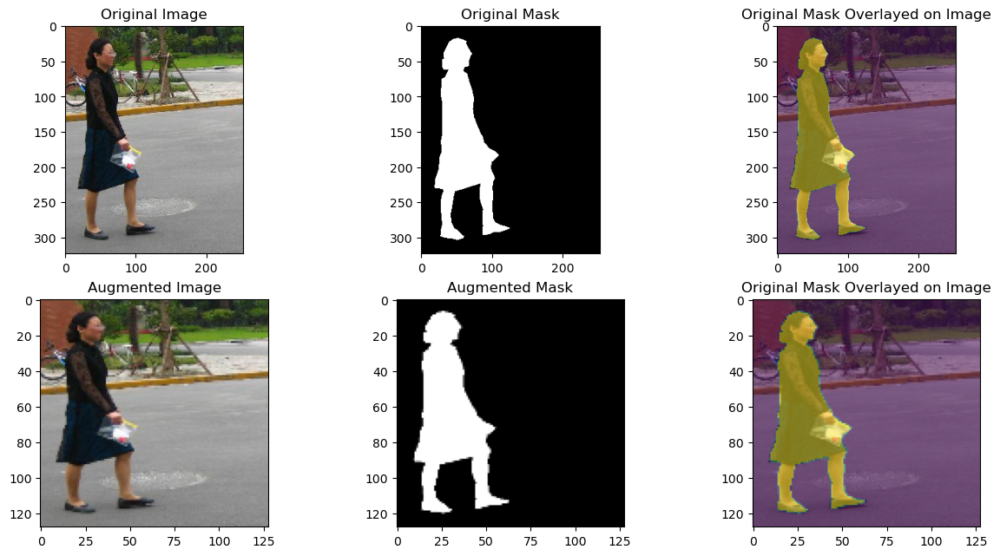
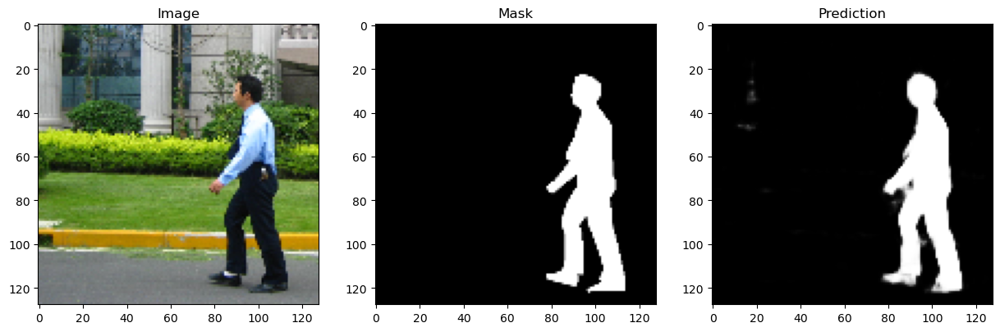

# Computer Assignment 4: CNN Segmentation
## Alaqian Zafar - aaz7118

## Table of Contents
- <a href='#p1a'>Part (a)</a>
- <a href='#p1b'>Part (b)</a>
- <a href='#p1c'>Part (c)</a>
    - [Architecture](#Architecture)
    - [Loss Function](#Loss-Function)
- <a href='#p1d'>Part (d)</a>
- <a href='#p2a'>Part (e)</a>
- <a href='#p2b'>Part (f)</a>
- <a href='#p2c'>Part (g)</a>


```python
import os
import random

import cv2
import matplotlib.pyplot as plt
import numpy as np
import torch
import torch.nn as nn
from torch.utils.data import DataLoader
from torch.utils.data import Dataset
from torchvision import transforms
from tqdm import tqdm

%matplotlib inline
```


```python
try:
    from google.colab import drive
    drive.mount('/content/drive')
    path = '/content/drive/MyDrive/ECE-GY 6123 Image and Video Processing/Computer Assignments/CA04/archive'
except:
    path = 'archive'
```

<a id='p1a'></a>
##### (a) Cut the FudanPed dataset into an 80-10-10 train-val-test split.

[Table of Contents](#Table-of-Contents)


```python
image_paths = sorted([os.path.join(path, "PNGImages", image) for image in os.listdir(os.path.join(path, "PNGImages"))])
mask_paths = sorted([os.path.join(path, "PedMasks", mask) for mask in os.listdir(os.path.join(path, "PedMasks"))])

indices = list(range(len(image_paths)))
train_indices = random.sample(indices, k=int(len(indices)*0.8))
val_indices = random.sample(set(indices)-set(train_indices), k=int(len(indices)*0.1))
test_indices = list(set(indices)-set(train_indices)-set(val_indices))

train_image_paths = [image_paths[i] for i in train_indices]
train_mask_paths = [mask_paths[i] for i in train_indices]
val_image_paths = [image_paths[i] for i in val_indices]
val_mask_paths = [mask_paths[i] for i in val_indices]
test_image_paths = [image_paths[i] for i in test_indices]
test_mask_paths = [mask_paths[i] for i in test_indices]

class PennFudanDataset(Dataset):
    def __init__(self, image_paths, mask_paths, transform=None):
        self.image_paths = image_paths
        self.mask_paths = mask_paths
        self.transform = transform

    def __len__(self):
        return len(self.image_paths)

    def __getitem__(self, idx):
        image = cv2.imread(self.image_paths[idx])
        image = cv2.cvtColor(image, cv2.COLOR_BGR2RGB)
        mask = cv2.imread(self.mask_paths[idx], 0)
        # Set all values greater-than or equal-to 1 to 255.
        mask = np.clip(mask, 0, 1)*255
        merged_image = np.concatenate((image, mask[:, :, None]), axis=2)
        merged_image = transforms.ToTensor()(merged_image)
        if self.transform:
            merged_image = self.transform(merged_image)
        image = merged_image[:3, :, :]
        mask = merged_image[3, :, :]
        return image, mask
```

<a id='p1b'></a>
##### (b) Apply data augmentation to your dataset during training and show an example of your data augmentation in your report.

[Table of Contents](#Table-of-Contents)


```python
# Plot a subplot of the original and the augmented image and mask
train_dataset = PennFudanDataset(train_image_paths, train_mask_paths)
image, mask = train_dataset[0]
fig, ax = plt.subplots(2, 3, figsize=(15, 7.5))
ax[0,0].imshow(image.permute(1, 2, 0))
ax[0,0].set_title("Original Image")
ax[0,1].imshow(mask, cmap="gray")
ax[0,1].set_title("Original Mask")
ax[0,2].imshow(image.permute(1, 2, 0))
ax[0,2].imshow(mask, alpha=0.5)
ax[0,2].set_title("Original Mask Overlayed on Image")

image_size = (128,128)
augmentation = transforms.Compose([
    transforms.RandomHorizontalFlip(),
    transforms.Resize(image_size)
    ])
augmented_train_dataset = PennFudanDataset(train_image_paths, train_mask_paths, transform=augmentation)
image, mask = augmented_train_dataset[0]
ax[1,0].imshow(image.permute(1, 2, 0))
ax[1,0].set_title("Augmented Image")
ax[1,1].imshow(mask, cmap="gray")
ax[1,1].set_title("Augmented Mask")
ax[1,2].imshow(image.permute(1, 2, 0))
ax[1,2].imshow(mask, alpha=0.5)
ax[1,2].set_title("Original Mask Overlayed on Image")

batchsize = 8

train_loader = DataLoader(augmented_train_dataset, batch_size=batchsize, shuffle=True)
test_dataset = PennFudanDataset(
    test_image_paths,
    test_mask_paths, 
    transform=transforms.Resize(image_size))
test_loader = DataLoader(test_dataset, batch_size=batchsize, shuffle=False)
val_dataset = PennFudanDataset(
    val_image_paths, 
    val_mask_paths, 
    transform=transforms.Resize(image_size))
val_loader = DataLoader(test_dataset, batch_size=batchsize, shuffle=False)
```


    

    


<a id='p1c'></a>
##### (c) Implement and train a CNN for binary segmentation on your train split. Describe your network architecture, loss function, and any training hyper-parameters. You may implement any architecture you'd like, **but the implementation must be your own code.**

[Table of Contents](#Table-of-Contents)

#### Architecture

`x` (input) → `Conv_BN_ReLU1` → `Downsample1` → `x1` → `x2` → `Conv_BN_ReLU2` → `x3` → `Downsample2` → `x4` → `Conv_BN_ReLU3` → `x5` → `Upsample1` → `x6` → `cat(x3)` → `x7` → `Conv_BN_ReLU4` → `x8` → `Upsamle2` → `x9` → `cat(x1)` → `x10` → `Conv_BN_ReLU5` → `x11` → `conv6` → `x12` → `sigmoid` → `x13` (output)


```python
class UNET(nn.Module):
    def __init__(self):
        super(UNET, self).__init__()
        self.Conv_BN_ReLU1 = self._Conv_BN_ReLU(3, 16)
        self.Downsample1 = nn.MaxPool2d(kernel_size=2, stride=2)
        self.Conv_BN_ReLU2 = self._Conv_BN_ReLU(16, 32)
        self.Downsample2 = nn.MaxPool2d(kernel_size=2, stride=2)
        self.Conv_BN_ReLU3 = self._Conv_BN_ReLU(32, 32)
        self.Upsample1 = nn.Upsample(scale_factor=2, mode="bilinear", align_corners=True)
        self.Conv_BN_ReLU4 = self._Conv_BN_ReLU(64, 16)
        self.Upsample2 = nn.Upsample(scale_factor=2, mode="bilinear", align_corners=True)
        self.Conv_BN_ReLU5 = self._Conv_BN_ReLU(32, 16)
        self.Conv6 = nn.Conv2d(16, 1, kernel_size=1)

    def _Conv_BN_ReLU(self, in_channels, out_channels):
        return nn.Sequential(
            nn.Conv2d(in_channels, out_channels, kernel_size=3, padding='same'),
            nn.BatchNorm2d(out_channels),
            nn.ReLU(inplace=True),
            nn.Conv2d(out_channels, out_channels, kernel_size=3, padding='same'),
            nn.BatchNorm2d(out_channels),
            nn.ReLU(inplace=True)
        )
    
    def forward(self, x):
        x1 = self.Conv_BN_ReLU1(x) # 3x128x128 -> 16x128x128
        x2 = self.Downsample1(x1) # 16x128x128 -> 16x64x64
        x3 = self.Conv_BN_ReLU2(x2) # 16x64x64 -> 32x64x64
        x4 = self.Downsample2(x3) # 32x64x64 -> 32x32x32
        x5 = self.Conv_BN_ReLU3(x4) # 32x32x32 -> 32x32x32\
        x6 = self.Upsample1(x5) # 32x32x32 -> 32x64x64
        x7 = torch.cat((x6, x3), dim=1) # 32x64x64 + 32x64x64 -> 64x64x64
        x8 = self.Conv_BN_ReLU4(x7) # 64x64x64 -> 16x64x64
        x9 = self.Upsample2(x8) # 16x64x64 -> 16x128x128
        x10 = torch.cat((x9, x1), dim=1) # 16x128x128 + 16x128x128 -> 32x128x128
        x11 = self.Conv_BN_ReLU5(x10) # 32x128x128 -> 16x128x128
        x12 = self.Conv6(x11) # 16x128x128 -> 1x128x128
        x13 = torch.sigmoid(x12) # 1x128x128 -> 1x128x128
        return x13
```

#### Loss Function

[Table of Contents](#Table-of-Contents)


```python
def dice_coefficient(pred, target):
    smooth = 1.
    pred = pred.view(-1)
    target = target.view(-1)
    intersection = (pred * target).sum()
    return (2. * intersection + smooth) / (pred.sum() + target.sum() + smooth)

class SoftDiceLoss(nn.Module):
    def __init__(self):
        super(SoftDiceLoss, self).__init__()
    
    def forward(self, pred, target):
        smooth = 1.
        pred = pred.view(-1)
        target = target.view(-1)
        intersection = (pred * target).sum()
        return 1 - (2. * intersection + smooth) / ((pred ** 2).sum() + (target ** 2).sum() + smooth)
```

#### Training

[Table of Contents](#Table-of-Contents)


```python
def save_checkpoint(filename, model, optimizer, epoch, val_loss):
    torch.save({
        "model": model.state_dict(),
        "optimizer": optimizer.state_dict(),
        "epoch": epoch,
        "loss": val_loss}, filename)
    
def load_checkpoint(filename, model, optimizer):
    checkpoint = torch.load(filename)
    model.load_state_dict(checkpoint["model"])
    optimizer.load_state_dict(checkpoint["optimizer"])
    epoch = checkpoint["epoch"]
    loss = checkpoint["loss"]
    return model, optimizer, epoch, loss

def train(model, train_loader, optimizer, criterion, device):
    model.train()
    train_loss = 0
    for image, mask in train_loader:
        image = image.to(device)
        mask = mask.to(device)
        optimizer.zero_grad()
        pred = model(image)
        loss = criterion(pred, mask)
        loss.backward()
        optimizer.step()
        train_loss += loss.item()
    return train_loss / len(train_loader)

def evaluate(model, val_loader, criterion, device):
    model.eval()
    val_loss = 0
    with torch.no_grad():
        for image, mask in val_loader:
            image = image.to(device)
            mask = mask.to(device)
            pred = model(image)
            loss = criterion(pred, mask)
            val_loss += loss.item()
    return val_loss / len(val_loader)


NUM_EPOCHS = 160
learning_rate=0.001
device = torch.device("cuda" if torch.cuda.is_available() else "cpu")
model = UNET().to(device)
criterion = SoftDiceLoss()
optimizer = torch.optim.Adam(model.parameters(), lr=learning_rate)
checkpoint_dir = "./checkpoints"
checkpoint_path = os.path.join(checkpoint_dir, "checkpoint.pth")

if os.path.exists(checkpoint_path):
    model, optimizer, start_epoch, val_loss = load_checkpoint(checkpoint_path, model, optimizer)
    print("Checkpoint loaded: start epoch = {}, val loss = {}".format(start_epoch, val_loss))
else:
    start_epoch = 0
    val_loss = np.inf

train_losses = []
val_losses = []
for epoch in range(start_epoch, start_epoch+NUM_EPOCHS):
    progress_bar = tqdm(train_loader)
    train_loss = train(model, progress_bar, optimizer, criterion, device)
    val_loss = evaluate(model, val_loader, criterion, device)
    print("Epoch: {}/{}...".format(epoch+1, NUM_EPOCHS),
            "Train Loss: {:.4f}...".format(train_loss),
            "Val Loss: {:.4f}".format(val_loss))
    train_losses.append(train_loss)
    val_losses.append(val_loss)
save_checkpoint(checkpoint_path, model, optimizer, epoch, val_loss)

```

    100%|██████████| 17/17 [00:06<00:00,  2.81it/s]
    

    Epoch: 1/160... Train Loss: 0.5012... Val Loss: 0.5592
    

    100%|██████████| 17/17 [00:05<00:00,  2.98it/s]
    

    Epoch: 2/160... Train Loss: 0.4249... Val Loss: 0.5324
    

    100%|██████████| 17/17 [00:05<00:00,  2.89it/s]
    

    Epoch: 3/160... Train Loss: 0.3860... Val Loss: 0.4717
    

    100%|██████████| 17/17 [00:05<00:00,  2.88it/s]
    

    Epoch: 4/160... Train Loss: 0.3588... Val Loss: 0.3836
    

    100%|██████████| 17/17 [00:05<00:00,  2.85it/s]
    

    Epoch: 5/160... Train Loss: 0.3297... Val Loss: 0.3546
    

    100%|██████████| 17/17 [00:05<00:00,  2.93it/s]
    

    Epoch: 6/160... Train Loss: 0.3108... Val Loss: 0.3456
    

    100%|██████████| 17/17 [00:05<00:00,  3.04it/s]
    

    Epoch: 7/160... Train Loss: 0.2889... Val Loss: 0.3351
    

    100%|██████████| 17/17 [00:05<00:00,  3.02it/s]
    

    Epoch: 8/160... Train Loss: 0.2778... Val Loss: 0.3202
    

    100%|██████████| 17/17 [00:05<00:00,  3.03it/s]
    

    Epoch: 9/160... Train Loss: 0.2586... Val Loss: 0.3064
    

    100%|██████████| 17/17 [00:05<00:00,  3.04it/s]
    

    Epoch: 10/160... Train Loss: 0.2533... Val Loss: 0.2959
    

    100%|██████████| 17/17 [00:05<00:00,  3.02it/s]
    

    Epoch: 11/160... Train Loss: 0.2368... Val Loss: 0.2772
    

    100%|██████████| 17/17 [00:05<00:00,  3.03it/s]
    

    Epoch: 12/160... Train Loss: 0.2183... Val Loss: 0.2942
    

    100%|██████████| 17/17 [00:05<00:00,  2.89it/s]
    

    Epoch: 13/160... Train Loss: 0.2141... Val Loss: 0.2933
    

    100%|██████████| 17/17 [00:06<00:00,  2.79it/s]
    

    Epoch: 14/160... Train Loss: 0.2056... Val Loss: 0.2602
    

    100%|██████████| 17/17 [00:05<00:00,  2.85it/s]
    

    Epoch: 15/160... Train Loss: 0.1966... Val Loss: 0.2609
    

    100%|██████████| 17/17 [00:06<00:00,  2.82it/s]
    

    Epoch: 16/160... Train Loss: 0.1986... Val Loss: 0.2754
    

    100%|██████████| 17/17 [00:05<00:00,  2.95it/s]
    

    Epoch: 17/160... Train Loss: 0.1843... Val Loss: 0.2779
    

    100%|██████████| 17/17 [00:06<00:00,  2.83it/s]
    

    Epoch: 18/160... Train Loss: 0.1812... Val Loss: 0.2839
    

    100%|██████████| 17/17 [00:06<00:00,  2.71it/s]
    

    Epoch: 19/160... Train Loss: 0.1964... Val Loss: 0.2557
    

    100%|██████████| 17/17 [00:05<00:00,  2.87it/s]
    

    Epoch: 20/160... Train Loss: 0.1842... Val Loss: 0.2646
    

    100%|██████████| 17/17 [00:05<00:00,  2.89it/s]
    

    Epoch: 21/160... Train Loss: 0.1700... Val Loss: 0.2692
    

    100%|██████████| 17/17 [00:05<00:00,  2.92it/s]
    

    Epoch: 22/160... Train Loss: 0.1682... Val Loss: 0.2369
    

    100%|██████████| 17/17 [00:05<00:00,  2.96it/s]
    

    Epoch: 23/160... Train Loss: 0.1647... Val Loss: 0.2995
    

    100%|██████████| 17/17 [00:05<00:00,  3.02it/s]
    

    Epoch: 24/160... Train Loss: 0.1521... Val Loss: 0.2826
    

    100%|██████████| 17/17 [00:05<00:00,  3.01it/s]
    

    Epoch: 25/160... Train Loss: 0.1605... Val Loss: 0.2547
    

    100%|██████████| 17/17 [00:05<00:00,  3.01it/s]
    

    Epoch: 26/160... Train Loss: 0.1592... Val Loss: 0.2177
    

    100%|██████████| 17/17 [00:05<00:00,  3.01it/s]
    

    Epoch: 27/160... Train Loss: 0.1483... Val Loss: 0.2396
    

    100%|██████████| 17/17 [00:05<00:00,  3.02it/s]
    

    Epoch: 28/160... Train Loss: 0.1415... Val Loss: 0.2843
    

    100%|██████████| 17/17 [00:05<00:00,  3.03it/s]
    

    Epoch: 29/160... Train Loss: 0.1526... Val Loss: 0.2478
    

    100%|██████████| 17/17 [00:05<00:00,  3.03it/s]
    

    Epoch: 30/160... Train Loss: 0.1391... Val Loss: 0.2314
    

    100%|██████████| 17/17 [00:05<00:00,  3.00it/s]
    

    Epoch: 31/160... Train Loss: 0.1327... Val Loss: 0.2229
    

    100%|██████████| 17/17 [00:05<00:00,  2.96it/s]
    

    Epoch: 32/160... Train Loss: 0.1434... Val Loss: 0.2015
    

    100%|██████████| 17/17 [00:05<00:00,  2.97it/s]
    

    Epoch: 33/160... Train Loss: 0.1299... Val Loss: 0.2829
    

    100%|██████████| 17/17 [00:06<00:00,  2.74it/s]
    

    Epoch: 34/160... Train Loss: 0.1277... Val Loss: 0.2344
    

    100%|██████████| 17/17 [00:05<00:00,  3.01it/s]
    

    Epoch: 35/160... Train Loss: 0.1294... Val Loss: 0.2292
    

    100%|██████████| 17/17 [00:05<00:00,  2.99it/s]
    

    Epoch: 36/160... Train Loss: 0.1274... Val Loss: 0.2594
    

    100%|██████████| 17/17 [00:05<00:00,  3.01it/s]
    

    Epoch: 37/160... Train Loss: 0.1210... Val Loss: 0.2497
    

    100%|██████████| 17/17 [00:05<00:00,  3.00it/s]
    

    Epoch: 38/160... Train Loss: 0.1163... Val Loss: 0.2194
    

    100%|██████████| 17/17 [00:05<00:00,  3.02it/s]
    

    Epoch: 39/160... Train Loss: 0.1198... Val Loss: 0.2352
    

    100%|██████████| 17/17 [00:05<00:00,  3.01it/s]
    

    Epoch: 40/160... Train Loss: 0.1157... Val Loss: 0.2867
    

    100%|██████████| 17/17 [00:05<00:00,  2.99it/s]
    

    Epoch: 41/160... Train Loss: 0.1077... Val Loss: 0.3859
    

    100%|██████████| 17/17 [00:05<00:00,  2.99it/s]
    

    Epoch: 42/160... Train Loss: 0.1084... Val Loss: 0.2163
    

    100%|██████████| 17/17 [00:05<00:00,  2.98it/s]
    

    Epoch: 43/160... Train Loss: 0.1021... Val Loss: 0.2148
    

    100%|██████████| 17/17 [00:05<00:00,  2.99it/s]
    

    Epoch: 44/160... Train Loss: 0.1055... Val Loss: 0.2259
    

    100%|██████████| 17/17 [00:05<00:00,  2.99it/s]
    

    Epoch: 45/160... Train Loss: 0.1036... Val Loss: 0.2179
    

    100%|██████████| 17/17 [00:05<00:00,  3.02it/s]
    

    Epoch: 46/160... Train Loss: 0.1112... Val Loss: 0.3078
    

    100%|██████████| 17/17 [00:05<00:00,  2.98it/s]
    

    Epoch: 47/160... Train Loss: 0.1216... Val Loss: 0.2546
    

    100%|██████████| 17/17 [00:05<00:00,  2.95it/s]
    

    Epoch: 48/160... Train Loss: 0.1049... Val Loss: 0.2658
    

    100%|██████████| 17/17 [00:05<00:00,  2.92it/s]
    

    Epoch: 49/160... Train Loss: 0.0982... Val Loss: 0.2599
    

    100%|██████████| 17/17 [00:05<00:00,  2.99it/s]
    

    Epoch: 50/160... Train Loss: 0.0930... Val Loss: 0.3443
    

    100%|██████████| 17/17 [00:05<00:00,  2.92it/s]
    

    Epoch: 51/160... Train Loss: 0.0913... Val Loss: 0.2409
    

    100%|██████████| 17/17 [00:05<00:00,  2.95it/s]
    

    Epoch: 52/160... Train Loss: 0.1009... Val Loss: 0.1993
    

    100%|██████████| 17/17 [00:05<00:00,  2.94it/s]
    

    Epoch: 53/160... Train Loss: 0.1024... Val Loss: 0.2297
    

    100%|██████████| 17/17 [00:05<00:00,  3.00it/s]
    

    Epoch: 54/160... Train Loss: 0.1046... Val Loss: 0.2713
    

    100%|██████████| 17/17 [00:05<00:00,  2.98it/s]
    

    Epoch: 55/160... Train Loss: 0.1047... Val Loss: 0.2249
    

    100%|██████████| 17/17 [00:05<00:00,  2.97it/s]
    

    Epoch: 56/160... Train Loss: 0.1051... Val Loss: 0.2172
    

    100%|██████████| 17/17 [00:05<00:00,  2.97it/s]
    

    Epoch: 57/160... Train Loss: 0.0979... Val Loss: 0.2133
    

    100%|██████████| 17/17 [00:05<00:00,  3.00it/s]
    

    Epoch: 58/160... Train Loss: 0.1053... Val Loss: 0.2244
    

    100%|██████████| 17/17 [00:05<00:00,  3.00it/s]
    

    Epoch: 59/160... Train Loss: 0.0970... Val Loss: 0.2119
    

    100%|██████████| 17/17 [00:05<00:00,  2.92it/s]
    

    Epoch: 60/160... Train Loss: 0.0904... Val Loss: 0.3017
    

    100%|██████████| 17/17 [00:06<00:00,  2.80it/s]
    

    Epoch: 61/160... Train Loss: 0.0847... Val Loss: 0.2488
    

    100%|██████████| 17/17 [00:06<00:00,  2.76it/s]
    

    Epoch: 62/160... Train Loss: 0.0850... Val Loss: 0.2103
    

    100%|██████████| 17/17 [00:06<00:00,  2.68it/s]
    

    Epoch: 63/160... Train Loss: 0.0830... Val Loss: 0.2199
    

    100%|██████████| 17/17 [00:05<00:00,  2.90it/s]
    

    Epoch: 64/160... Train Loss: 0.0835... Val Loss: 0.2565
    

    100%|██████████| 17/17 [00:05<00:00,  2.93it/s]
    

    Epoch: 65/160... Train Loss: 0.0797... Val Loss: 0.2603
    

    100%|██████████| 17/17 [00:05<00:00,  2.99it/s]
    

    Epoch: 66/160... Train Loss: 0.0779... Val Loss: 0.2647
    

    100%|██████████| 17/17 [00:05<00:00,  3.00it/s]
    

    Epoch: 67/160... Train Loss: 0.0732... Val Loss: 0.2023
    

    100%|██████████| 17/17 [00:05<00:00,  3.01it/s]
    

    Epoch: 68/160... Train Loss: 0.0758... Val Loss: 0.2365
    

    100%|██████████| 17/17 [00:05<00:00,  2.96it/s]
    

    Epoch: 69/160... Train Loss: 0.0762... Val Loss: 0.2234
    

    100%|██████████| 17/17 [00:05<00:00,  3.00it/s]
    

    Epoch: 70/160... Train Loss: 0.0745... Val Loss: 0.2314
    

    100%|██████████| 17/17 [00:05<00:00,  2.95it/s]
    

    Epoch: 71/160... Train Loss: 0.0754... Val Loss: 0.2163
    

    100%|██████████| 17/17 [00:05<00:00,  2.96it/s]
    

    Epoch: 72/160... Train Loss: 0.0709... Val Loss: 0.1981
    

    100%|██████████| 17/17 [00:05<00:00,  2.98it/s]
    

    Epoch: 73/160... Train Loss: 0.0673... Val Loss: 0.3873
    

    100%|██████████| 17/17 [00:05<00:00,  2.93it/s]
    

    Epoch: 74/160... Train Loss: 0.0685... Val Loss: 0.2003
    

    100%|██████████| 17/17 [00:05<00:00,  2.98it/s]
    

    Epoch: 75/160... Train Loss: 0.0672... Val Loss: 0.2225
    

    100%|██████████| 17/17 [00:05<00:00,  2.97it/s]
    

    Epoch: 76/160... Train Loss: 0.0646... Val Loss: 0.2209
    

    100%|██████████| 17/17 [00:05<00:00,  3.00it/s]
    

    Epoch: 77/160... Train Loss: 0.0680... Val Loss: 0.2468
    

    100%|██████████| 17/17 [00:05<00:00,  3.04it/s]
    

    Epoch: 78/160... Train Loss: 0.0723... Val Loss: 0.2466
    

    100%|██████████| 17/17 [00:05<00:00,  3.02it/s]
    

    Epoch: 79/160... Train Loss: 0.0668... Val Loss: 0.1905
    

    100%|██████████| 17/17 [00:05<00:00,  3.04it/s]
    

    Epoch: 80/160... Train Loss: 0.0629... Val Loss: 0.2153
    

    100%|██████████| 17/17 [00:05<00:00,  2.99it/s]
    

    Epoch: 81/160... Train Loss: 0.0669... Val Loss: 0.3027
    

    100%|██████████| 17/17 [00:05<00:00,  2.98it/s]
    

    Epoch: 82/160... Train Loss: 0.0641... Val Loss: 0.2181
    

    100%|██████████| 17/17 [00:05<00:00,  3.04it/s]
    

    Epoch: 83/160... Train Loss: 0.0668... Val Loss: 0.1991
    

    100%|██████████| 17/17 [00:05<00:00,  3.01it/s]
    

    Epoch: 84/160... Train Loss: 0.0666... Val Loss: 0.2069
    

    100%|██████████| 17/17 [00:05<00:00,  3.03it/s]
    

    Epoch: 85/160... Train Loss: 0.0672... Val Loss: 0.2638
    

    100%|██████████| 17/17 [00:05<00:00,  3.00it/s]
    

    Epoch: 86/160... Train Loss: 0.0707... Val Loss: 0.2741
    

    100%|██████████| 17/17 [00:05<00:00,  2.99it/s]
    

    Epoch: 87/160... Train Loss: 0.0657... Val Loss: 0.2316
    

    100%|██████████| 17/17 [00:05<00:00,  3.02it/s]
    

    Epoch: 88/160... Train Loss: 0.0621... Val Loss: 0.2389
    

    100%|██████████| 17/17 [00:05<00:00,  3.03it/s]
    

    Epoch: 89/160... Train Loss: 0.0575... Val Loss: 0.2199
    

    100%|██████████| 17/17 [00:05<00:00,  2.98it/s]
    

    Epoch: 90/160... Train Loss: 0.0553... Val Loss: 0.1925
    

    100%|██████████| 17/17 [00:05<00:00,  3.03it/s]
    

    Epoch: 91/160... Train Loss: 0.0553... Val Loss: 0.2352
    

    100%|██████████| 17/17 [00:05<00:00,  3.02it/s]
    

    Epoch: 92/160... Train Loss: 0.0685... Val Loss: 0.2674
    

    100%|██████████| 17/17 [00:05<00:00,  2.97it/s]
    

    Epoch: 93/160... Train Loss: 0.0697... Val Loss: 0.2223
    

    100%|██████████| 17/17 [00:05<00:00,  3.00it/s]
    

    Epoch: 94/160... Train Loss: 0.0639... Val Loss: 0.2053
    

    100%|██████████| 17/17 [00:05<00:00,  3.00it/s]
    

    Epoch: 95/160... Train Loss: 0.0613... Val Loss: 0.2367
    

    100%|██████████| 17/17 [00:05<00:00,  3.00it/s]
    

    Epoch: 96/160... Train Loss: 0.0593... Val Loss: 0.2258
    

    100%|██████████| 17/17 [00:05<00:00,  3.02it/s]
    

    Epoch: 97/160... Train Loss: 0.0625... Val Loss: 0.2309
    

    100%|██████████| 17/17 [00:05<00:00,  3.00it/s]
    

    Epoch: 98/160... Train Loss: 0.0587... Val Loss: 0.3015
    

    100%|██████████| 17/17 [00:05<00:00,  3.00it/s]
    

    Epoch: 99/160... Train Loss: 0.0537... Val Loss: 0.2140
    

    100%|██████████| 17/17 [00:05<00:00,  2.99it/s]
    

    Epoch: 100/160... Train Loss: 0.0529... Val Loss: 0.2125
    

    100%|██████████| 17/17 [00:05<00:00,  3.01it/s]
    

    Epoch: 101/160... Train Loss: 0.0569... Val Loss: 0.2217
    

    100%|██████████| 17/17 [00:05<00:00,  3.02it/s]
    

    Epoch: 102/160... Train Loss: 0.0544... Val Loss: 0.2078
    

    100%|██████████| 17/17 [00:05<00:00,  3.02it/s]
    

    Epoch: 103/160... Train Loss: 0.0596... Val Loss: 0.1973
    

    100%|██████████| 17/17 [00:05<00:00,  2.96it/s]
    

    Epoch: 104/160... Train Loss: 0.0500... Val Loss: 0.2247
    

    100%|██████████| 17/17 [00:05<00:00,  3.00it/s]
    

    Epoch: 105/160... Train Loss: 0.0519... Val Loss: 0.2323
    

    100%|██████████| 17/17 [00:05<00:00,  3.01it/s]
    

    Epoch: 106/160... Train Loss: 0.0490... Val Loss: 0.2072
    

    100%|██████████| 17/17 [00:05<00:00,  3.00it/s]
    

    Epoch: 107/160... Train Loss: 0.0470... Val Loss: 0.2620
    

    100%|██████████| 17/17 [00:05<00:00,  2.99it/s]
    

    Epoch: 108/160... Train Loss: 0.0481... Val Loss: 0.1996
    

    100%|██████████| 17/17 [00:05<00:00,  3.01it/s]
    

    Epoch: 109/160... Train Loss: 0.0500... Val Loss: 0.2497
    

    100%|██████████| 17/17 [00:05<00:00,  2.97it/s]
    

    Epoch: 110/160... Train Loss: 0.0476... Val Loss: 0.2224
    

    100%|██████████| 17/17 [00:05<00:00,  3.01it/s]
    

    Epoch: 111/160... Train Loss: 0.0479... Val Loss: 0.2231
    

    100%|██████████| 17/17 [00:05<00:00,  2.97it/s]
    

    Epoch: 112/160... Train Loss: 0.0449... Val Loss: 0.2550
    

    100%|██████████| 17/17 [00:05<00:00,  2.96it/s]
    

    Epoch: 113/160... Train Loss: 0.0458... Val Loss: 0.2286
    

    100%|██████████| 17/17 [00:05<00:00,  2.98it/s]
    

    Epoch: 114/160... Train Loss: 0.0453... Val Loss: 0.2099
    

    100%|██████████| 17/17 [00:05<00:00,  2.97it/s]
    

    Epoch: 115/160... Train Loss: 0.0461... Val Loss: 0.1986
    

    100%|██████████| 17/17 [00:05<00:00,  3.01it/s]
    

    Epoch: 116/160... Train Loss: 0.0449... Val Loss: 0.2612
    

    100%|██████████| 17/17 [00:05<00:00,  2.98it/s]
    

    Epoch: 117/160... Train Loss: 0.0493... Val Loss: 0.2636
    

    100%|██████████| 17/17 [00:05<00:00,  2.96it/s]
    

    Epoch: 118/160... Train Loss: 0.0489... Val Loss: 0.2360
    

    100%|██████████| 17/17 [00:05<00:00,  3.01it/s]
    

    Epoch: 119/160... Train Loss: 0.0472... Val Loss: 0.2049
    

    100%|██████████| 17/17 [00:05<00:00,  3.02it/s]
    

    Epoch: 120/160... Train Loss: 0.0454... Val Loss: 0.2841
    

    100%|██████████| 17/17 [00:06<00:00,  2.75it/s]
    

    Epoch: 121/160... Train Loss: 0.0455... Val Loss: 0.2681
    

    100%|██████████| 17/17 [00:05<00:00,  2.97it/s]
    

    Epoch: 122/160... Train Loss: 0.0462... Val Loss: 0.2179
    

    100%|██████████| 17/17 [00:05<00:00,  2.99it/s]
    

    Epoch: 123/160... Train Loss: 0.0491... Val Loss: 0.2553
    

    100%|██████████| 17/17 [00:05<00:00,  3.01it/s]
    

    Epoch: 124/160... Train Loss: 0.0514... Val Loss: 0.2251
    

    100%|██████████| 17/17 [00:05<00:00,  2.99it/s]
    

    Epoch: 125/160... Train Loss: 0.0485... Val Loss: 0.3162
    

    100%|██████████| 17/17 [00:05<00:00,  3.00it/s]
    

    Epoch: 126/160... Train Loss: 0.0461... Val Loss: 0.2475
    

    100%|██████████| 17/17 [00:05<00:00,  2.96it/s]
    

    Epoch: 127/160... Train Loss: 0.0431... Val Loss: 0.2212
    

    100%|██████████| 17/17 [00:05<00:00,  2.97it/s]
    

    Epoch: 128/160... Train Loss: 0.0460... Val Loss: 0.1995
    

    100%|██████████| 17/17 [00:05<00:00,  2.97it/s]
    

    Epoch: 129/160... Train Loss: 0.0436... Val Loss: 0.2525
    

    100%|██████████| 17/17 [00:05<00:00,  2.97it/s]
    

    Epoch: 130/160... Train Loss: 0.0429... Val Loss: 0.2084
    

    100%|██████████| 17/17 [00:05<00:00,  2.88it/s]
    

    Epoch: 131/160... Train Loss: 0.0419... Val Loss: 0.2375
    

    100%|██████████| 17/17 [00:06<00:00,  2.83it/s]
    

    Epoch: 132/160... Train Loss: 0.0451... Val Loss: 0.2679
    

    100%|██████████| 17/17 [00:05<00:00,  2.92it/s]
    

    Epoch: 133/160... Train Loss: 0.0419... Val Loss: 0.2109
    

    100%|██████████| 17/17 [00:05<00:00,  2.99it/s]
    

    Epoch: 134/160... Train Loss: 0.0430... Val Loss: 0.2317
    

    100%|██████████| 17/17 [00:05<00:00,  2.98it/s]
    

    Epoch: 135/160... Train Loss: 0.0404... Val Loss: 0.2805
    

    100%|██████████| 17/17 [00:05<00:00,  2.97it/s]
    

    Epoch: 136/160... Train Loss: 0.0420... Val Loss: 0.2259
    

    100%|██████████| 17/17 [00:05<00:00,  2.96it/s]
    

    Epoch: 137/160... Train Loss: 0.0441... Val Loss: 0.2402
    

    100%|██████████| 17/17 [00:05<00:00,  2.99it/s]
    

    Epoch: 138/160... Train Loss: 0.0425... Val Loss: 0.2225
    

    100%|██████████| 17/17 [00:05<00:00,  2.89it/s]
    

    Epoch: 139/160... Train Loss: 0.0468... Val Loss: 0.2163
    

    100%|██████████| 17/17 [00:05<00:00,  2.99it/s]
    

    Epoch: 140/160... Train Loss: 0.0448... Val Loss: 0.3188
    

    100%|██████████| 17/17 [00:05<00:00,  3.01it/s]
    

    Epoch: 141/160... Train Loss: 0.0460... Val Loss: 0.2126
    

    100%|██████████| 17/17 [00:05<00:00,  3.00it/s]
    

    Epoch: 142/160... Train Loss: 0.0502... Val Loss: 0.2182
    

    100%|██████████| 17/17 [00:05<00:00,  2.98it/s]
    

    Epoch: 143/160... Train Loss: 0.0451... Val Loss: 0.2188
    

    100%|██████████| 17/17 [00:05<00:00,  2.98it/s]
    

    Epoch: 144/160... Train Loss: 0.0427... Val Loss: 0.3171
    

    100%|██████████| 17/17 [00:05<00:00,  2.99it/s]
    

    Epoch: 145/160... Train Loss: 0.0439... Val Loss: 0.2425
    

    100%|██████████| 17/17 [00:05<00:00,  2.98it/s]
    

    Epoch: 146/160... Train Loss: 0.0424... Val Loss: 0.2339
    

    100%|██████████| 17/17 [00:05<00:00,  2.97it/s]
    

    Epoch: 147/160... Train Loss: 0.0420... Val Loss: 0.2675
    

    100%|██████████| 17/17 [00:05<00:00,  3.00it/s]
    

    Epoch: 148/160... Train Loss: 0.0369... Val Loss: 0.2709
    

    100%|██████████| 17/17 [00:05<00:00,  2.95it/s]
    

    Epoch: 149/160... Train Loss: 0.0398... Val Loss: 0.2863
    

    100%|██████████| 17/17 [00:05<00:00,  2.88it/s]
    

    Epoch: 150/160... Train Loss: 0.0409... Val Loss: 0.2261
    

    100%|██████████| 17/17 [00:05<00:00,  2.95it/s]
    

    Epoch: 151/160... Train Loss: 0.0418... Val Loss: 0.2460
    

    100%|██████████| 17/17 [00:05<00:00,  2.97it/s]
    

    Epoch: 152/160... Train Loss: 0.0426... Val Loss: 0.3115
    

    100%|██████████| 17/17 [00:05<00:00,  2.97it/s]
    

    Epoch: 153/160... Train Loss: 0.0413... Val Loss: 0.2462
    

    100%|██████████| 17/17 [00:05<00:00,  3.00it/s]
    

    Epoch: 154/160... Train Loss: 0.0375... Val Loss: 0.2421
    

    100%|██████████| 17/17 [00:05<00:00,  2.98it/s]
    

    Epoch: 155/160... Train Loss: 0.0383... Val Loss: 0.2156
    

    100%|██████████| 17/17 [00:05<00:00,  2.97it/s]
    

    Epoch: 156/160... Train Loss: 0.0409... Val Loss: 0.2210
    

    100%|██████████| 17/17 [00:05<00:00,  3.02it/s]
    

    Epoch: 157/160... Train Loss: 0.0414... Val Loss: 0.3273
    

    100%|██████████| 17/17 [00:05<00:00,  2.95it/s]
    

    Epoch: 158/160... Train Loss: 0.0389... Val Loss: 0.2665
    

    100%|██████████| 17/17 [00:05<00:00,  2.97it/s]
    

    Epoch: 159/160... Train Loss: 0.0372... Val Loss: 0.2483
    

    100%|██████████| 17/17 [00:05<00:00,  2.99it/s]
    

    Epoch: 160/160... Train Loss: 0.0372... Val Loss: 0.2313
    


```python
# Use the model on the test set and visualize the results
model.eval()
with torch.no_grad():
    image, mask = next(iter(test_loader))
    image = image.to(device)
    mask = mask.to(device)
    pred = model(image)
    pred = pred.cpu().numpy()
    mask = mask.cpu().numpy()
    image = image.cpu().numpy()
    pred = np.squeeze(pred, axis=1)
    fig, ax = plt.subplots(1, 3, figsize=(15, 15))
    ax[0].imshow(image[0].transpose(1, 2,0))
    ax[0].set_title("Image")
    ax[1].imshow(mask[0], cmap="gray")
    ax[1].set_title("Mask")
    ax[2].imshow(pred[0], cmap="gray")
    ax[2].set_title("Prediction")
    plt.show()

```


    

    


<a id='p1d'></a>
##### (d) Report training loss, validation loss, and validation DICE curves. Comment on any overfitting or underfitting observed.

[Table of Contents](#Table-of-Contents)

<a id='p2a'></a>
##### (e) Report the average dice score over your test-set. **You should be able to achieve a score of around 0.7 or better**.

[Table of Contents](#Table-of-Contents)

<a id='p2b'></a>
##### (f) Show at least 3 example segmentations (i.e. show the RGB image, mask, and RGB image X mask for 3 samples) from your training data and 3 from your testing data. Comment on the generalization capabilities of your trained network.

[Table of Contents](#Table-of-Contents)

<a id='p2c'></a>
##### (g) Show at least 1 example segmentation on an input image **<ins>not</ins> from the FudanPed dataset**. Again, comment on the generalization capabilities of your network with respect to this "out-of-distribution" image.

[Table of Contents](#Table-of-Contents)
