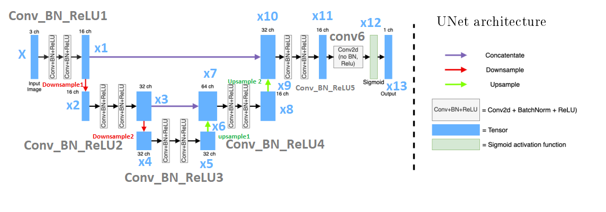

# Computer Assignment 4: CNN Segmentation
## Alaqian Zafar - aaz7118

## Table of Contents
- <a href='#p1a'>Part (a)</a>
- <a href='#p1b'>Part (b)</a>
- <a href='#p1c'>Part (c)</a>
    - [Architecture](#Architecture)
    - [Loss Function](#Loss-Function)
- <a href='#p1d'>Part (d)</a>
- <a href='#p2a'>Part (e)</a>
- <a href='#p2b'>Part (f)</a>
- <a href='#p2c'>Part (g)</a>


```python
import os
import random

import cv2
import matplotlib.pyplot as plt
import numpy as np
import torch
import torch.nn as nn
from torch.utils.data import DataLoader
from torch.utils.data import Dataset
from torchvision import transforms
from tqdm import tqdm

%matplotlib inline
```


```python
try:
    from google.colab import drive
    drive.mount('/content/drive')
    path = '/content/drive/MyDrive/ECE-GY 6123 Image and Video Processing/Computer Assignments/CA04/archive'
except:
    path = 'archive'
```

<a id='p1a'></a>
##### (a) Cut the FudanPed dataset into an 80-10-10 train-val-test split.

[Table of Contents](#Table-of-Contents)


```python
image_paths = sorted([os.path.join(path, "PNGImages", image) for image in os.listdir(os.path.join(path, "PNGImages"))])
mask_paths = sorted([os.path.join(path, "PedMasks", mask) for mask in os.listdir(os.path.join(path, "PedMasks"))])

indices = list(range(len(image_paths)))
train_indices = random.sample(indices, k=int(len(indices)*0.8))
val_indices = random.sample(set(indices)-set(train_indices), k=int(len(indices)*0.1))
test_indices = list(set(indices)-set(train_indices)-set(val_indices))

train_image_paths = [image_paths[i] for i in train_indices]
train_mask_paths = [mask_paths[i] for i in train_indices]
val_image_paths = [image_paths[i] for i in val_indices]
val_mask_paths = [mask_paths[i] for i in val_indices]
test_image_paths = [image_paths[i] for i in test_indices]
test_mask_paths = [mask_paths[i] for i in test_indices]

class PennFudanDataset(Dataset):
    def __init__(self, image_paths, mask_paths, transform=None):
        self.image_paths = image_paths
        self.mask_paths = mask_paths
        self.transform = transform

    def __len__(self):
        return len(self.image_paths)

    def __getitem__(self, idx):
        image = cv2.imread(self.image_paths[idx])
        image = cv2.cvtColor(image, cv2.COLOR_BGR2RGB)
        mask = cv2.imread(self.mask_paths[idx], 0)
        # Set all values greater-than or equal-to 1 to 255.
        mask = np.clip(mask, 0, 1)*255
        merged_image = np.concatenate((image, mask[:, :, None]), axis=2)
        merged_image = transforms.ToTensor()(merged_image)
        if self.transform:
            merged_image = self.transform(merged_image)
        image = merged_image[:3, :, :]
        mask = merged_image[3, :, :]
        return image, mask
```

<a id='p1b'></a>
##### (b) Apply data augmentation to your dataset during training and show an example of your data augmentation in your report.

[Table of Contents](#Table-of-Contents)


```python
# Plot a subplot of the original and the augmented image and mask
train_dataset = PennFudanDataset(train_image_paths, train_mask_paths)
image, mask = train_dataset[0]
fig, ax = plt.subplots(2, 3, figsize=(15, 7.5))
ax[0,0].imshow(image.permute(1, 2, 0))
ax[0,0].set_title("Original Image")
ax[0,1].imshow(mask, cmap="gray")
ax[0,1].set_title("Original Mask")
ax[0,2].imshow(image.permute(1, 2, 0))
ax[0,2].imshow(mask, alpha=0.5)
ax[0,2].set_title("Original Mask Overlayed on Image")

image_size = (128,128)
augmentation = transforms.Compose([
    transforms.RandomHorizontalFlip(),
    transforms.Resize(image_size)
    ])
augmented_train_dataset = PennFudanDataset(train_image_paths, train_mask_paths, transform=augmentation)
image, mask = augmented_train_dataset[0]
ax[1,0].imshow(image.permute(1, 2, 0))
ax[1,0].set_title("Augmented Image")
ax[1,1].imshow(mask, cmap="gray")
ax[1,1].set_title("Augmented Mask")
ax[1,2].imshow(image.permute(1, 2, 0))
ax[1,2].imshow(mask, alpha=0.5)
ax[1,2].set_title("Original Mask Overlayed on Image")

batchsize = 8

train_loader = DataLoader(augmented_train_dataset, batch_size=batchsize, shuffle=True)
test_dataset = PennFudanDataset(
    test_image_paths,
    test_mask_paths, 
    transform=transforms.Resize(image_size))
test_loader = DataLoader(test_dataset, batch_size=batchsize, shuffle=False)
val_dataset = PennFudanDataset(
    val_image_paths, 
    val_mask_paths, 
    transform=transforms.Resize(image_size))
val_loader = DataLoader(test_dataset, batch_size=batchsize, shuffle=False)
```


    

    


<a id='p1c'></a>
##### (c) Implement and train a CNN for binary segmentation on your train split. Describe your network architecture, loss function, and any training hyper-parameters. You may implement any architecture you'd like, **but the implementation must be your own code.**

[Table of Contents](#Table-of-Contents)

#### Architecture

`x` (input) → `Conv_BN_ReLU1` → `Downsample1` → `x1` → `x2` → `Conv_BN_ReLU2` → `x3` → `Downsample2` → `x4` → `Conv_BN_ReLU3` → `x5` → `Upsample1` → `x6` → `cat(x3)` → `x7` → `Conv_BN_ReLU4` → `x8` → `Upsamle2` → `x9` → `cat(x1)` → `x10` → `Conv_BN_ReLU5` → `x11` → `conv6` → `x12` → `sigmoid` → `x13` (output)




```python
class UNET(nn.Module):
    def __init__(self):
        super(UNET, self).__init__()
        self.Conv_BN_ReLU1 = self._Conv_BN_ReLU(3, 16)
        self.Downsample1 = nn.MaxPool2d(kernel_size=2, stride=2)
        self.Conv_BN_ReLU2 = self._Conv_BN_ReLU(16, 32)
        self.Downsample2 = nn.MaxPool2d(kernel_size=2, stride=2)
        self.Conv_BN_ReLU3 = self._Conv_BN_ReLU(32, 32)
        self.Upsample1 = nn.Upsample(scale_factor=2, mode="bilinear", align_corners=True)
        self.Conv_BN_ReLU4 = self._Conv_BN_ReLU(64, 16)
        self.Upsample2 = nn.Upsample(scale_factor=2, mode="bilinear", align_corners=True)
        self.Conv_BN_ReLU5 = self._Conv_BN_ReLU(32, 16)
        self.Conv6 = nn.Conv2d(16, 1, kernel_size=1)

    def _Conv_BN_ReLU(self, in_channels, out_channels):
        return nn.Sequential(
            nn.Conv2d(in_channels, out_channels, kernel_size=3, padding='same'),
            nn.BatchNorm2d(out_channels),
            nn.ReLU(inplace=True),
            nn.Conv2d(out_channels, out_channels, kernel_size=3, padding='same'),
            nn.BatchNorm2d(out_channels),
            nn.ReLU(inplace=True)
        )
    
    def forward(self, x):
        x1 = self.Conv_BN_ReLU1(x) # 3x128x128 -> 16x128x128
        x2 = self.Downsample1(x1) # 16x128x128 -> 16x64x64
        x3 = self.Conv_BN_ReLU2(x2) # 16x64x64 -> 32x64x64
        x4 = self.Downsample2(x3) # 32x64x64 -> 32x32x32
        x5 = self.Conv_BN_ReLU3(x4) # 32x32x32 -> 32x32x32\
        x6 = self.Upsample1(x5) # 32x32x32 -> 32x64x64
        x7 = torch.cat((x6, x3), dim=1) # 32x64x64 + 32x64x64 -> 64x64x64
        x8 = self.Conv_BN_ReLU4(x7) # 64x64x64 -> 16x64x64
        x9 = self.Upsample2(x8) # 16x64x64 -> 16x128x128
        x10 = torch.cat((x9, x1), dim=1) # 16x128x128 + 16x128x128 -> 32x128x128
        x11 = self.Conv_BN_ReLU5(x10) # 32x128x128 -> 16x128x128
        x12 = self.Conv6(x11) # 16x128x128 -> 1x128x128
        x13 = torch.sigmoid(x12) # 1x128x128 -> 1x128x128
        return x13
```

#### Loss Function

[Table of Contents](#Table-of-Contents)


```python
def dice_coefficient(pred, target):
    smooth = 1.
    pred = pred.view(-1)
    target = target.view(-1)
    intersection = (pred * target).sum()
    return (2. * intersection + smooth) / (pred.sum() + target.sum() + smooth)

class SoftDiceLoss(nn.Module):
    def __init__(self):
        super(SoftDiceLoss, self).__init__()
    
    def forward(self, pred, target):
        smooth = 1.
        pred = pred.view(-1)
        target = target.view(-1)
        intersection = (pred * target).sum()
        return 1 - (2. * intersection + smooth) / ((pred ** 2).sum() + (target ** 2).sum() + smooth)
```

#### Training

[Table of Contents](#Table-of-Contents)


```python
def save_checkpoint(filename, model, optimizer, epoch, val_loss):
    torch.save({
        "model": model.state_dict(),
        "optimizer": optimizer.state_dict(),
        "epoch": epoch,
        "loss": val_loss}, filename)
    
def load_checkpoint(filename, model, optimizer):
    checkpoint = torch.load(filename)
    model.load_state_dict(checkpoint["model"])
    optimizer.load_state_dict(checkpoint["optimizer"])
    epoch = checkpoint["epoch"]
    loss = checkpoint["loss"]
    return model, optimizer, epoch, loss

def train(model, train_loader, optimizer, criterion, device):
    model.train()
    train_loss = 0
    for image, mask in train_loader:
        image = image.to(device)
        mask = mask.to(device)
        optimizer.zero_grad()
        pred = model(image)
        loss = criterion(pred, mask[:,None,:,:])
        loss.backward()
        optimizer.step()
        train_loss += loss.item()
    return train_loss / len(train_loader)

def evaluate(model, val_loader, criterion, device):
    model.eval()
    val_loss = 0
    with torch.no_grad():
        for image, mask in val_loader:
            image = image.to(device)
            mask = mask.to(device)
            pred = model(image)
            loss = criterion(pred, mask[:,None,:,:])
            val_loss += loss.item()
    return val_loss / len(val_loader)


NUM_EPOCHS = 40
learning_rate=0.001
device = torch.device("cuda" if torch.cuda.is_available() else "cpu")
model = UNET().to(device)
criterion = SoftDiceLoss()
optimizer = torch.optim.Adam(model.parameters(), lr=learning_rate)
checkpoint_dir = "./checkpoints"
checkpoint_path = os.path.join(checkpoint_dir, "checkpoint.pth")

if os.path.exists(checkpoint_path):
    model, optimizer, start_epoch, val_loss = load_checkpoint(checkpoint_path, model, optimizer)
    print("Checkpoint loaded: start epoch = {}, val loss = {}".format(start_epoch, val_loss))
else:
    start_epoch = 0
    val_loss = np.inf

train_losses = []
val_losses = []
for epoch in range(start_epoch, start_epoch+NUM_EPOCHS):
    progress_bar = tqdm(train_loader)
    train_loss = train(model, progress_bar, optimizer, criterion, device)
    val_loss = evaluate(model, val_loader, criterion, device)
    print("Epoch: {}/{}...".format(epoch+1, start_epoch+NUM_EPOCHS),
            "Train Loss: {:.4f}...".format(train_loss),
            "Val Loss: {:.4f}".format(val_loss))
    train_losses.append(train_loss)
    val_losses.append(val_loss)
save_checkpoint(checkpoint_path, model, optimizer, epoch, val_loss)

```

    Checkpoint loaded: start epoch = 318, val loss = 0.1399708390235901
    

    100%|██████████| 17/17 [00:06<00:00,  2.67it/s]
    

    Epoch: 319/358... Train Loss: 0.0226... Val Loss: 0.1364
    

    100%|██████████| 17/17 [00:06<00:00,  2.73it/s]
    

    Epoch: 320/358... Train Loss: 0.0234... Val Loss: 0.1617
    

    100%|██████████| 17/17 [00:06<00:00,  2.70it/s]
    

    Epoch: 321/358... Train Loss: 0.0229... Val Loss: 0.1439
    

    100%|██████████| 17/17 [00:06<00:00,  2.74it/s]
    

    Epoch: 322/358... Train Loss: 0.0266... Val Loss: 0.1393
    

    100%|██████████| 17/17 [00:06<00:00,  2.83it/s]
    

    Epoch: 323/358... Train Loss: 0.0251... Val Loss: 0.1427
    

    100%|██████████| 17/17 [00:05<00:00,  2.84it/s]
    

    Epoch: 324/358... Train Loss: 0.0255... Val Loss: 0.1482
    

    100%|██████████| 17/17 [00:06<00:00,  2.77it/s]
    

    Epoch: 325/358... Train Loss: 0.0239... Val Loss: 0.1669
    

    100%|██████████| 17/17 [00:06<00:00,  2.66it/s]
    

    Epoch: 326/358... Train Loss: 0.0248... Val Loss: 0.1326
    

    100%|██████████| 17/17 [00:06<00:00,  2.75it/s]
    

    Epoch: 327/358... Train Loss: 0.0245... Val Loss: 0.1483
    

    100%|██████████| 17/17 [00:06<00:00,  2.78it/s]
    

    Epoch: 328/358... Train Loss: 0.0242... Val Loss: 0.1563
    

    100%|██████████| 17/17 [00:06<00:00,  2.74it/s]
    

    Epoch: 329/358... Train Loss: 0.0237... Val Loss: 0.1873
    

    100%|██████████| 17/17 [00:06<00:00,  2.78it/s]
    

    Epoch: 330/358... Train Loss: 0.0248... Val Loss: 0.1598
    

    100%|██████████| 17/17 [00:06<00:00,  2.73it/s]
    

    Epoch: 331/358... Train Loss: 0.0264... Val Loss: 0.1982
    

    100%|██████████| 17/17 [00:06<00:00,  2.83it/s]
    

    Epoch: 332/358... Train Loss: 0.0296... Val Loss: 0.2024
    

    100%|██████████| 17/17 [00:05<00:00,  2.89it/s]
    

    Epoch: 333/358... Train Loss: 0.0296... Val Loss: 0.1416
    

    100%|██████████| 17/17 [00:06<00:00,  2.59it/s]
    

    Epoch: 334/358... Train Loss: 0.0343... Val Loss: 0.1607
    

    100%|██████████| 17/17 [00:05<00:00,  2.86it/s]
    

    Epoch: 335/358... Train Loss: 0.0307... Val Loss: 0.1890
    

    100%|██████████| 17/17 [00:06<00:00,  2.82it/s]
    

    Epoch: 336/358... Train Loss: 0.0298... Val Loss: 0.1646
    

    100%|██████████| 17/17 [00:05<00:00,  2.84it/s]
    

    Epoch: 337/358... Train Loss: 0.0293... Val Loss: 0.1775
    

    100%|██████████| 17/17 [00:06<00:00,  2.82it/s]
    

    Epoch: 338/358... Train Loss: 0.0304... Val Loss: 0.1744
    

    100%|██████████| 17/17 [00:06<00:00,  2.78it/s]
    

    Epoch: 339/358... Train Loss: 0.0303... Val Loss: 0.1862
    

    100%|██████████| 17/17 [00:06<00:00,  2.77it/s]
    

    Epoch: 340/358... Train Loss: 0.0263... Val Loss: 0.1509
    

    100%|██████████| 17/17 [00:06<00:00,  2.77it/s]
    

    Epoch: 341/358... Train Loss: 0.0270... Val Loss: 0.1534
    

    100%|██████████| 17/17 [00:05<00:00,  2.84it/s]
    

    Epoch: 342/358... Train Loss: 0.0261... Val Loss: 0.1646
    

    100%|██████████| 17/17 [00:05<00:00,  2.84it/s]
    

    Epoch: 343/358... Train Loss: 0.0252... Val Loss: 0.1401
    

    100%|██████████| 17/17 [00:05<00:00,  2.85it/s]
    

    Epoch: 344/358... Train Loss: 0.0260... Val Loss: 0.1645
    

    100%|██████████| 17/17 [00:05<00:00,  2.87it/s]
    

    Epoch: 345/358... Train Loss: 0.0268... Val Loss: 0.1393
    

    100%|██████████| 17/17 [00:05<00:00,  2.84it/s]
    

    Epoch: 346/358... Train Loss: 0.0251... Val Loss: 0.1637
    

    100%|██████████| 17/17 [00:06<00:00,  2.78it/s]
    

    Epoch: 347/358... Train Loss: 0.0275... Val Loss: 0.1782
    

    100%|██████████| 17/17 [00:06<00:00,  2.80it/s]
    

    Epoch: 348/358... Train Loss: 0.0276... Val Loss: 0.1688
    

    100%|██████████| 17/17 [00:05<00:00,  2.84it/s]
    

    Epoch: 349/358... Train Loss: 0.0279... Val Loss: 0.1442
    

    100%|██████████| 17/17 [00:06<00:00,  2.75it/s]
    

    Epoch: 350/358... Train Loss: 0.0259... Val Loss: 0.1508
    

    100%|██████████| 17/17 [00:06<00:00,  2.76it/s]
    

    Epoch: 351/358... Train Loss: 0.0269... Val Loss: 0.1737
    

    100%|██████████| 17/17 [00:06<00:00,  2.80it/s]
    

    Epoch: 352/358... Train Loss: 0.0259... Val Loss: 0.1652
    

    100%|██████████| 17/17 [00:06<00:00,  2.81it/s]
    

    Epoch: 353/358... Train Loss: 0.0246... Val Loss: 0.1503
    

    100%|██████████| 17/17 [00:05<00:00,  2.84it/s]
    

    Epoch: 354/358... Train Loss: 0.0251... Val Loss: 0.1557
    

    100%|██████████| 17/17 [00:06<00:00,  2.83it/s]
    

    Epoch: 355/358... Train Loss: 0.0252... Val Loss: 0.1744
    

    100%|██████████| 17/17 [00:05<00:00,  2.84it/s]
    

    Epoch: 356/358... Train Loss: 0.0252... Val Loss: 0.1531
    

    100%|██████████| 17/17 [00:05<00:00,  2.88it/s]
    

    Epoch: 357/358... Train Loss: 0.0230... Val Loss: 0.1600
    

    100%|██████████| 17/17 [00:06<00:00,  2.83it/s]
    

    Epoch: 358/358... Train Loss: 0.0228... Val Loss: 0.1677
    


```python
# Use the model on the test set and visualize the results
model.eval()
with torch.no_grad():
    image, mask = next(iter(test_loader))
    image = image.to(device)
    mask = mask.to(device)
    pred = model(image)
    pred = pred.cpu().numpy()
    mask = mask.cpu().numpy()
    image = image.cpu().numpy()
    pred = np.squeeze(pred, axis=1)
    fig, ax = plt.subplots(1, 3, figsize=(15, 15))
    ax[0].imshow(image[4].transpose(1, 2,0))
    ax[0].set_title("Image")
    ax[1].imshow(mask[4], cmap="gray")
    ax[1].set_title("Mask")
    ax[2].imshow(pred[4], cmap="gray")
    ax[2].set_title("Prediction")
    plt.show()

    for image in os.listdir("./out_of_distribution_images"):
        image = cv2.imread(os.path.join("./out_of_distribution_images", image))
        image = cv2.cvtColor(image, cv2.COLOR_BGR2RGB)
        image = cv2.resize(image, (128, 128))
        image = image.transpose(2, 0, 1)
        image = image / 255
        image = torch.from_numpy(image).float()
        image = image.to(device)
        pred = model(image[None, ...])
        pred = pred.cpu().numpy()
        pred = np.squeeze(pred, axis=1)
        plt.subplot(1, 2, 1)
        plt.imshow(image.cpu().numpy().transpose(1, 2, 0))
        plt.subplot(1, 2, 2)
        plt.imshow(pred[0], cmap="gray")
        plt.show()
        

```


    

    


    

    


    

    


    

    


The model is trained for 40 epochs and the results are shown below. The model is able to detect the edges of the objects in the image and the mask. The model is not able to detect the objects completely. This is because the dataset is very small and the model is not able to learn the features of the objects. The model is also not able to detect the objects that are not present in the training set.


<a id='p1d'></a>
##### (d) Report training loss, validation loss, and validation DICE curves. Comment on any overfitting or underfitting observed.

[Table of Contents](#Table-of-Contents)

<a id='p2a'></a>
##### (e) Report the average dice score over your test-set. **You should be able to achieve a score of around 0.7 or better**.

[Table of Contents](#Table-of-Contents)

<a id='p2b'></a>
##### (f) Show at least 3 example segmentations (i.e. show the RGB image, mask, and RGB image X mask for 3 samples) from your training data and 3 from your testing data. Comment on the generalization capabilities of your trained network.

[Table of Contents](#Table-of-Contents)

<a id='p2c'></a>
##### (g) Show at least 1 example segmentation on an input image **<ins>not</ins> from the FudanPed dataset**. Again, comment on the generalization capabilities of your network with respect to this "out-of-distribution" image.

[Table of Contents](#Table-of-Contents)
