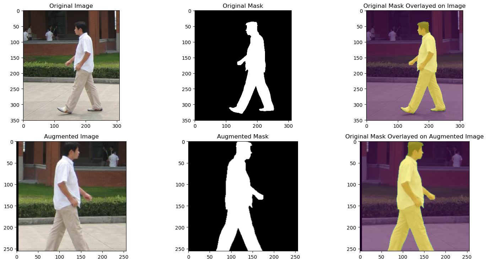
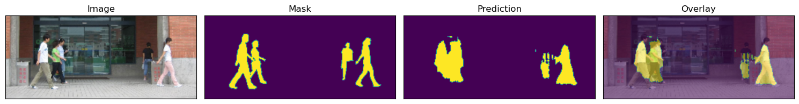
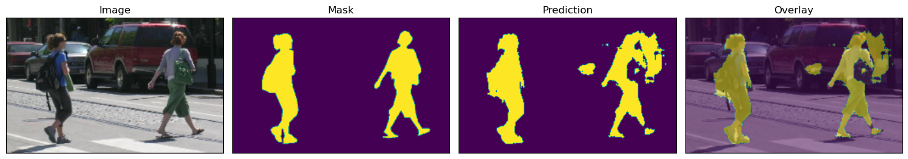

# Computer Assignment 4: CNN Segmentation
## Alaqian Zafar - aaz7118

## Table of Contents
- <a href='#p1a'>Part (a)</a>
    - [Dataset Split](#Dataset-Split)
    - [PennFudanDataset Class](#PennFudanDataset-Class)
- <a href='#p1b'>Part (b)</a>
- <a href='#p1c'>Part (c)</a>
    - [Architecture](#Architecture)
    - [Loss Function](#Loss-Function)
    - [Training and Evaluation Functions](#Training-and-Evaluation-Functions)
    - [Functions for Saving and Loading Checkpoint](#Functions-for-Saving-and-Loading-Checkpoint)
    - [Training Hyperparameters](#Training-Hyperparameters)
    - [Training for 100 Epochs at 0.001 Learning Rate](#Training-for-100-Epochs-at-0.001-Learning-Rate)
    - [Training with a Learning Rate Scheduler](#Training-with-a-Learning-Rate-Scheduler)
- <a href='#p1d'>Part (d)</a>
- <a href='#p2a'>Part (e)</a>
- <a href='#p2b'>Part (f)</a>
- <a href='#p2c'>Part (g)</a>


```python
import os
import random

import cv2
import matplotlib.pyplot as plt
import numpy as np
import torch
import torch.nn as nn
from torch.utils.data import DataLoader
from torch.utils.data import Dataset
from torchvision import transforms
from tqdm import tqdm

%matplotlib inline
```


```python
try:
    from google.colab import drive
    drive.mount('/content/drive')
    path = '/content/drive/MyDrive/ECE-GY 6123 Image and Video Processing/Computer Assignments/CA04/archive'
except:
    path = 'archive'
```

<a id='p1a'></a>
##### (a) Cut the FudanPed dataset into an 80-10-10 train-val-test split.

[Table of Contents](#Table-of-Contents)

##### Dataset Split


```python
image_paths = sorted([os.path.join(path, "PNGImages", image) for image in os.listdir(os.path.join(path, "PNGImages"))])
mask_paths = sorted([os.path.join(path, "PedMasks", mask) for mask in os.listdir(os.path.join(path, "PedMasks"))])

indices = list(range(len(image_paths)))
train_indices = random.sample(indices, k=int(len(indices)*0.8))
val_indices = random.sample(set(indices)-set(train_indices), k=int(len(indices)*0.1))
test_indices = list(set(indices)-set(train_indices)-set(val_indices))

train_image_paths = [image_paths[i] for i in train_indices]
train_mask_paths = [mask_paths[i] for i in train_indices]
val_image_paths = [image_paths[i] for i in val_indices]
val_mask_paths = [mask_paths[i] for i in val_indices]
test_image_paths = [image_paths[i] for i in test_indices]
test_mask_paths = [mask_paths[i] for i in test_indices]
```

    C:\Users\Alqia\AppData\Local\Temp\ipykernel_30660\2302059204.py:6: DeprecationWarning: Sampling from a set deprecated
    since Python 3.9 and will be removed in a subsequent version.
      val_indices = random.sample(set(indices)-set(train_indices), k=int(len(indices)*0.1))
    

##### PennFudanDataset Class

[Table of Contents](#Table-of-Contents)


```python
def square_pad(image):
    h_diff = max(image.shape) - image.shape[0]
    w_diff = max(image.shape) - image.shape[1]

    top = (h_diff + 1) // 2 if h_diff % 2 == 1 else h_diff // 2
    bottom = h_diff // 2
    left = (w_diff + 1) // 2 if w_diff % 2 == 1 else w_diff // 2    
    right = w_diff // 2
    padded_image = cv2.copyMakeBorder(image, top, bottom, left, right, cv2.BORDER_CONSTANT, value=0)
    return padded_image, image.shape

def remove_pad(padded_image, original_shape):
    padded_image = cv2.resize(padded_image, (max(original_shape), max(original_shape)))
    h_diff = padded_image.shape[0] - original_shape[0]
    w_diff = padded_image.shape[1] - original_shape[1]

    h_start = (h_diff + 1) // 2 if h_diff % 2 == 1 else h_diff // 2
    h_end = padded_image.shape[0] - h_diff // 2
    w_start = (w_diff + 1) // 2 if w_diff % 2 == 1 else w_diff // 2
    w_end = padded_image.shape[1] - w_diff // 2

    return padded_image[h_start:h_end, w_start:w_end]

class PennFudanDataset(Dataset):
    def __init__(self, image_paths, mask_paths, image_size=None, transform=None):
        self.image_paths = image_paths
        self.mask_paths = mask_paths
        self.image_size = image_size
        self.transform = transform

    def __len__(self):
        return len(self.image_paths)

    def __getitem__(self, idx):
        image = cv2.imread(self.image_paths[idx])
        image = cv2.cvtColor(image, cv2.COLOR_BGR2RGB)
        mask = cv2.imread(self.mask_paths[idx], 0)
        # Set all values greater-than or equal-to 1 to 255.
        mask = np.clip(mask, 0, 1)*255
        if self.transform or self.image_size:
            merged_image = np.concatenate((image, mask[:, :, None]), axis=2)
            merged_image, merged_shape = square_pad(merged_image)
            merged_image = transforms.ToTensor()(merged_image)
            if self.transform:
                merged_image = self.transform(merged_image)
            if self.image_size:
                merged_image = transforms.Resize((self.image_size, self.image_size))(merged_image)
            image = merged_image[:3, :, :]
            mask = merged_image[3, :, :].unsqueeze(0)
            return image, mask, merged_shape
        else:
            image = transforms.ToTensor()(image)
            mask = transforms.ToTensor()(mask)
        return image, mask
```

<a id='p1b'></a>
##### (b) Apply data augmentation to your dataset during training and show an example of your data augmentation in your report.

[Table of Contents](#Table-of-Contents)


```python
# Plot a subplot of the original and the augmented image and mask
train_dataset = PennFudanDataset(train_image_paths, train_mask_paths)
image, mask = train_dataset[0]
fig, ax = plt.subplots(2, 3, figsize=(15, 7.5))
ax[0,0].imshow(image.permute(1, 2, 0))
ax[0,0].set_title("Original Image")
ax[0,1].imshow(mask.squeeze(), cmap="gray")
ax[0,1].set_title("Original Mask")
ax[0,2].imshow(image.permute(1, 2, 0))
ax[0,2].imshow(mask.squeeze(), alpha=0.5)
ax[0,2].set_title("Original Mask Overlayed on Image")

image_size = 256

augmentation = transforms.Compose([
    transforms.RandomHorizontalFlip(),
    transforms.RandomResizedCrop(size=image_size,scale=(0.35, 1.0), ratio=(1.0, 1.0))])
augmented_train_dataset = PennFudanDataset(
    train_image_paths, 
    train_mask_paths,
    transform=augmentation)
image, mask, _ = augmented_train_dataset[0]
ax[1,0].imshow(image.permute(1, 2, 0))
ax[1,0].set_title("Augmented Image")
ax[1,1].imshow(mask.squeeze(),cmap="gray")
ax[1,1].set_title("Augmented Mask")
ax[1,2].imshow(image.permute(1, 2, 0))
ax[1,2].imshow(mask.squeeze(), alpha=0.5)
ax[1,2].set_title("Original Mask Overlayed on Augmented Image")
plt.tight_layout()
plt.show()

test_dataset = PennFudanDataset(test_image_paths, test_mask_paths, image_size=image_size)

val_dataset = PennFudanDataset(val_image_paths, val_mask_paths, image_size=image_size)
```

    c:\Users\Alqia\miniconda3\envs\torch\lib\site-packages\torchvision\transforms\functional.py:1603: UserWarning: The default value of the antialias parameter of all the resizing transforms (Resize(), RandomResizedCrop(), etc.) will change from None to True in v0.17, in order to be consistent across the PIL and Tensor backends. To suppress this warning, directly pass antialias=True (recommended, future default), antialias=None (current default, which means False for Tensors and True for PIL), or antialias=False (only works on Tensors - PIL will still use antialiasing). This also applies if you are using the inference transforms from the models weights: update the call to weights.transforms(antialias=True).
      warnings.warn(
    


    

    


<a id='p1c'></a>
##### (c) Implement and train a CNN for binary segmentation on your train split. Describe your network architecture, loss function, and any training hyper-parameters. You may implement any architecture you'd like, **but the implementation must be your own code.**

[Table of Contents](#Table-of-Contents)

##### Architecture

`x` (input) → `Conv_BN_ReLU1` → `Downsample1` → `x1` → `x2` → `Conv_BN_ReLU2` → `x3` → `Downsample2` → `x4` → `Conv_BN_ReLU3` → `x5` → `Upsample1` → `x6` → `cat(x3)` → `x7` → `Conv_BN_ReLU4` → `x8` → `Upsamle2` → `x9` → `cat(x1)` → `x10` → `Conv_BN_ReLU5` → `x11` → `conv6` → `x12` → `sigmoid` → `x13` (output)


```python
class UNET(nn.Module):
    def __init__(self):
        super(UNET, self).__init__()
        self.Conv_BN_ReLU1 = self._Conv_BN_ReLU(3, 16)
        self.Downsample1 = nn.MaxPool2d(kernel_size=2, stride=2)
        self.Conv_BN_ReLU2 = self._Conv_BN_ReLU(16, 32)
        self.Downsample2 = nn.MaxPool2d(kernel_size=2, stride=2)
        self.Conv_BN_ReLU3 = self._Conv_BN_ReLU(32, 32)
        self.Upsample1 = nn.Upsample(scale_factor=2, mode="bilinear", align_corners=True)
        self.Conv_BN_ReLU4 = self._Conv_BN_ReLU(64, 16)
        self.Upsample2 = nn.Upsample(scale_factor=2, mode="bilinear", align_corners=True)
        self.Conv_BN_ReLU5 = self._Conv_BN_ReLU(32, 16)
        self.Conv6 = nn.Conv2d(16, 1, kernel_size=1)

    def _Conv_BN_ReLU(self, in_channels, out_channels):
        return nn.Sequential(
            nn.Conv2d(in_channels, out_channels, kernel_size=3, padding='same'),
            nn.BatchNorm2d(out_channels),
            nn.ReLU(inplace=True),
            nn.Conv2d(out_channels, out_channels, kernel_size=3, padding='same'),
            nn.BatchNorm2d(out_channels),
            nn.ReLU(inplace=True)
        )
    
    def forward(self, x):
        x1 = self.Conv_BN_ReLU1(x) # 3x128x128 -> 16x128x128
        x2 = self.Downsample1(x1) # 16x128x128 -> 16x64x64
        x3 = self.Conv_BN_ReLU2(x2) # 16x64x64 -> 32x64x64
        x4 = self.Downsample2(x3) # 32x64x64 -> 32x32x32
        x5 = self.Conv_BN_ReLU3(x4) # 32x32x32 -> 32x32x32
        x6 = self.Upsample1(x5) # 32x32x32 -> 32x64x64
        x7 = torch.cat((x6, x3), dim=1) # 32x64x64 + 32x64x64 -> 64x64x64
        x8 = self.Conv_BN_ReLU4(x7) # 64x64x64 -> 16x64x64
        x9 = self.Upsample2(x8) # 16x64x64 -> 16x128x128
        x10 = torch.cat((x9, x1), dim=1) # 16x128x128 + 16x128x128 -> 32x128x128
        x11 = self.Conv_BN_ReLU5(x10) # 32x128x128 -> 16x128x128
        x12 = self.Conv6(x11) # 16x128x128 -> 1x128x128
        x13 = torch.sigmoid(x12) # 1x128x128 -> 1x128x128
        return x13
```

##### Loss Function

[Table of Contents](#Table-of-Contents)


```python
def dice_coefficient(output, ground_truth):
    output = output.view(-1)
    ground_truth = ground_truth.view(-1)
    intersection = (output * ground_truth).sum()
    return (2. * intersection) / (output.sum() + ground_truth.sum())

class SoftDiceLoss(nn.Module):
    def __init__(self):
        super(SoftDiceLoss, self).__init__()
    
    def forward(self, output, ground_truth):
        numerical_stability = 1.
        output = output.view(-1)
        ground_truth = ground_truth.view(-1)
        intersection = (output * ground_truth).sum()
        return 1 - (2. * intersection + numerical_stability) / (output.sum() + ground_truth.sum() + numerical_stability)
```

##### Training and Evaluation Functions

[Table of Contents](#Table-of-Contents)


```python
def train(model, train_loader, optimizer, criterion, device):
    model.train()
    train_loss = 0
    for image, mask, _ in train_loader:
        image = image.to(device)
        mask = mask.to(device)
        optimizer.zero_grad()
        pred = (model(image))
        loss = criterion(pred, mask)
        loss.backward()
        optimizer.step()
        train_loss += loss.item()
    return train_loss / len(train_loader)

def evaluate(model, val_loader, criterion, device):
    model.eval()
    val_loss = 0
    with torch.no_grad():
        for image, mask, _ in val_loader:
            image = image.to(device)
            mask = mask.to(device)
            pred = torch.round(model(image))
            loss = criterion(pred, mask)
            val_loss += loss.item()
            dice = dice_coefficient(pred, mask)
    return val_loss / len(val_loader), dice
```

##### Functions for Saving and Loading Checkpoint

[Table of Contents](#Table-of-Contents)


```python
def save_checkpoint(filename, model, optimizer, epoch, val_loss):
    torch.save({
        "model": model.state_dict(),
        "optimizer": optimizer.state_dict(),
        "epoch": epoch,
        "loss": val_loss}, 
        filename)
    print(
            "Checkpoint saved:",
            "Epoch: {}".format(epoch),
            "Validation Loss: {:.4f}".format(val_loss),
            "Learning Rate: {:.3e}".format(optimizer.param_groups[0]["lr"]),
            sep="\t")
    
def load_checkpoint(filename, model, optimizer):
    checkpoint = torch.load(filename)
    model.load_state_dict(checkpoint["model"])
    optimizer.load_state_dict(checkpoint["optimizer"])
    epoch = checkpoint["epoch"]
    loss = checkpoint["loss"]
    print(
        "Checkpoint loaded:",
        "Epoch: {}".format(epoch),
        "Validation Loss: {:.4f}".format(loss),
        "Learning Rate: {:.3e}".format(optimizer.param_groups[0]["lr"]),
        sep="\t")
    return model, optimizer, epoch, loss
```

##### Training Hyperparameters

[Table of Contents](#Table-of-Contents)


```python
NUM_EPOCHS = 100
learning_rate=0.001
batchsize=8

device = torch.device("cuda:0" if torch.cuda.is_available() else "cpu")
checkpoint_dir = "./checkpoints"
checkpoint_path = os.path.join(checkpoint_dir, "checkpoint.pth")
criterion = SoftDiceLoss()#nn.BCELoss()#
model = UNET().to(device)
optimizer = torch.optim.Adam(model.parameters(), lr=learning_rate)
scheduler = torch.optim.lr_scheduler.ReduceLROnPlateau(optimizer, patience=20, verbose=True)

train_losses = []
val_losses = []
dice_coeffs = []
val_loader = DataLoader(val_dataset, batch_size=batchsize, shuffle=False)
train_loader = DataLoader(augmented_train_dataset, batch_size=batchsize, shuffle=True)
```

##### Training for 100 Epochs at 0.001 Learning Rate

[Table of Contents](#Table-of-Contents)


```python
if os.path.exists(checkpoint_path):
    model, optimizer, epoch, val_loss = load_checkpoint(checkpoint_path, model, optimizer)
    train_losses = train_losses[:epoch]
    val_losses = val_losses[:epoch]
else:
    epoch = 0
    val_loss = np.inf
    train_loss = np.inf
count = 0

while epoch < NUM_EPOCHS:
    epoch += 1
    progress_bar = tqdm(
        train_loader, 
        desc="Epoch {}".format(epoch),
        ncols=85,
        unit=" batches")
    train_loss = train(model, progress_bar, optimizer, criterion, device)
    val_loss, dice = evaluate(model, val_loader, criterion, device)
    train_losses.append(train_loss)
    val_losses.append(val_loss)
    dice_coeffs.append(dice)
    if val_loss == np.min(val_losses):
        save_checkpoint(checkpoint_path, model, optimizer, epoch, val_loss)
        count = 0
    else:
        count += 1
        if count == 5:
            print(
                "Training Progress:",
                "Train Loss: {:.4f}".format(train_loss),
                "Val Loss: {:.4f}".format(val_loss),
                sep="\t")
            count = 0
```

    Epoch 1: 100%|█████████████████████████████████| 17/17 [00:06<00:00,  2.57 batches/s]
    

    Checkpoint saved:	Epoch: 1	Validation Loss: 0.9978	Learning Rate: 1.000e-03
    

    Epoch 2: 100%|█████████████████████████████████| 17/17 [00:04<00:00,  4.22 batches/s]
    

    Checkpoint saved:	Epoch: 2	Validation Loss: 0.8292	Learning Rate: 1.000e-03
    

    Epoch 3: 100%|█████████████████████████████████| 17/17 [00:04<00:00,  3.75 batches/s]
    

    Checkpoint saved:	Epoch: 3	Validation Loss: 0.3829	Learning Rate: 1.000e-03
    

    Epoch 4: 100%|█████████████████████████████████| 17/17 [00:04<00:00,  3.86 batches/s]
    Epoch 5: 100%|█████████████████████████████████| 17/17 [00:04<00:00,  3.71 batches/s]
    

    Checkpoint saved:	Epoch: 5	Validation Loss: 0.3567	Learning Rate: 1.000e-03
    

    Epoch 6: 100%|█████████████████████████████████| 17/17 [00:04<00:00,  3.76 batches/s]
    

    Checkpoint saved:	Epoch: 6	Validation Loss: 0.3486	Learning Rate: 1.000e-03
    

    Epoch 7: 100%|█████████████████████████████████| 17/17 [00:04<00:00,  3.61 batches/s]
    Epoch 8: 100%|█████████████████████████████████| 17/17 [00:04<00:00,  3.82 batches/s]
    Epoch 9: 100%|█████████████████████████████████| 17/17 [00:04<00:00,  3.94 batches/s]
    Epoch 10: 100%|████████████████████████████████| 17/17 [00:04<00:00,  3.95 batches/s]
    Epoch 11: 100%|████████████████████████████████| 17/17 [00:04<00:00,  3.92 batches/s]
    

    Checkpoint saved:	Epoch: 11	Validation Loss: 0.3057	Learning Rate: 1.000e-03
    

    Epoch 12: 100%|████████████████████████████████| 17/17 [00:04<00:00,  3.97 batches/s]
    Epoch 13: 100%|████████████████████████████████| 17/17 [00:04<00:00,  3.75 batches/s]
    Epoch 14: 100%|████████████████████████████████| 17/17 [00:04<00:00,  3.88 batches/s]
    

    Checkpoint saved:	Epoch: 14	Validation Loss: 0.2872	Learning Rate: 1.000e-03
    

    Epoch 15: 100%|████████████████████████████████| 17/17 [00:04<00:00,  3.87 batches/s]
    

    Checkpoint saved:	Epoch: 15	Validation Loss: 0.2752	Learning Rate: 1.000e-03
    

    Epoch 16: 100%|████████████████████████████████| 17/17 [00:04<00:00,  3.75 batches/s]
    Epoch 17: 100%|████████████████████████████████| 17/17 [00:04<00:00,  3.97 batches/s]
    

    Checkpoint saved:	Epoch: 17	Validation Loss: 0.2679	Learning Rate: 1.000e-03
    

    Epoch 18: 100%|████████████████████████████████| 17/17 [00:04<00:00,  3.97 batches/s]
    

    Checkpoint saved:	Epoch: 18	Validation Loss: 0.2589	Learning Rate: 1.000e-03
    

    Epoch 19: 100%|████████████████████████████████| 17/17 [00:04<00:00,  3.72 batches/s]
    Epoch 20: 100%|████████████████████████████████| 17/17 [00:04<00:00,  3.97 batches/s]
    Epoch 21: 100%|████████████████████████████████| 17/17 [00:04<00:00,  3.88 batches/s]
    Epoch 22: 100%|████████████████████████████████| 17/17 [00:04<00:00,  3.96 batches/s]
    

    Checkpoint saved:	Epoch: 22	Validation Loss: 0.2576	Learning Rate: 1.000e-03
    

    Epoch 23: 100%|████████████████████████████████| 17/17 [00:04<00:00,  3.94 batches/s]
    Epoch 24: 100%|████████████████████████████████| 17/17 [00:04<00:00,  3.81 batches/s]
    

    Checkpoint saved:	Epoch: 24	Validation Loss: 0.2311	Learning Rate: 1.000e-03
    

    Epoch 25: 100%|████████████████████████████████| 17/17 [00:04<00:00,  3.95 batches/s]
    Epoch 26: 100%|████████████████████████████████| 17/17 [00:04<00:00,  3.80 batches/s]
    Epoch 27: 100%|████████████████████████████████| 17/17 [00:04<00:00,  3.89 batches/s]
    Epoch 28: 100%|████████████████████████████████| 17/17 [00:04<00:00,  3.90 batches/s]
    

    Checkpoint saved:	Epoch: 28	Validation Loss: 0.2166	Learning Rate: 1.000e-03
    

    Epoch 29: 100%|████████████████████████████████| 17/17 [00:04<00:00,  3.95 batches/s]
    Epoch 30: 100%|████████████████████████████████| 17/17 [00:04<00:00,  3.76 batches/s]
    Epoch 31: 100%|████████████████████████████████| 17/17 [00:04<00:00,  3.94 batches/s]
    Epoch 32: 100%|████████████████████████████████| 17/17 [00:04<00:00,  3.90 batches/s]
    Epoch 33: 100%|████████████████████████████████| 17/17 [00:04<00:00,  3.91 batches/s]
    

    Checkpoint saved:	Epoch: 33	Validation Loss: 0.2126	Learning Rate: 1.000e-03
    

    Epoch 34: 100%|████████████████████████████████| 17/17 [00:04<00:00,  3.86 batches/s]
    Epoch 35: 100%|████████████████████████████████| 17/17 [00:04<00:00,  3.88 batches/s]
    Epoch 36: 100%|████████████████████████████████| 17/17 [00:04<00:00,  3.89 batches/s]
    Epoch 37: 100%|████████████████████████████████| 17/17 [00:04<00:00,  3.92 batches/s]
    

    Checkpoint saved:	Epoch: 37	Validation Loss: 0.2091	Learning Rate: 1.000e-03
    

    Epoch 38: 100%|████████████████████████████████| 17/17 [00:04<00:00,  3.94 batches/s]
    Epoch 39: 100%|████████████████████████████████| 17/17 [00:04<00:00,  3.78 batches/s]
    Epoch 40: 100%|████████████████████████████████| 17/17 [00:04<00:00,  3.97 batches/s]
    Epoch 41: 100%|████████████████████████████████| 17/17 [00:04<00:00,  3.93 batches/s]
    Epoch 42: 100%|████████████████████████████████| 17/17 [00:04<00:00,  3.91 batches/s]
    

    Checkpoint saved:	Epoch: 42	Validation Loss: 0.2065	Learning Rate: 1.000e-03
    

    Epoch 43: 100%|████████████████████████████████| 17/17 [00:04<00:00,  3.96 batches/s]
    Epoch 44: 100%|████████████████████████████████| 17/17 [00:04<00:00,  3.78 batches/s]
    Epoch 45: 100%|████████████████████████████████| 17/17 [00:04<00:00,  3.92 batches/s]
    Epoch 46: 100%|████████████████████████████████| 17/17 [00:04<00:00,  3.97 batches/s]
    Epoch 47: 100%|████████████████████████████████| 17/17 [00:04<00:00,  3.96 batches/s]
    

    Training Progress:	Train Loss: 0.2371	Val Loss: 0.2571
    

    Epoch 48: 100%|████████████████████████████████| 17/17 [00:04<00:00,  3.91 batches/s]
    Epoch 49: 100%|████████████████████████████████| 17/17 [00:04<00:00,  3.96 batches/s]
    Epoch 50: 100%|████████████████████████████████| 17/17 [00:04<00:00,  3.93 batches/s]
    Epoch 51: 100%|████████████████████████████████| 17/17 [00:04<00:00,  3.99 batches/s]
    Epoch 52: 100%|████████████████████████████████| 17/17 [00:04<00:00,  3.92 batches/s]
    

    Training Progress:	Train Loss: 0.2409	Val Loss: 0.2214
    

    Epoch 53: 100%|████████████████████████████████| 17/17 [00:04<00:00,  3.97 batches/s]
    

    Checkpoint saved:	Epoch: 53	Validation Loss: 0.2037	Learning Rate: 1.000e-03
    

    Epoch 54: 100%|████████████████████████████████| 17/17 [00:04<00:00,  3.95 batches/s]
    Epoch 55: 100%|████████████████████████████████| 17/17 [00:04<00:00,  3.81 batches/s]
    Epoch 56: 100%|████████████████████████████████| 17/17 [00:04<00:00,  3.93 batches/s]
    Epoch 57: 100%|████████████████████████████████| 17/17 [00:04<00:00,  4.03 batches/s]
    Epoch 58: 100%|████████████████████████████████| 17/17 [00:04<00:00,  3.95 batches/s]
    

    Training Progress:	Train Loss: 0.2140	Val Loss: 0.2276
    

    Epoch 59: 100%|████████████████████████████████| 17/17 [00:04<00:00,  3.93 batches/s]
    Epoch 60: 100%|████████████████████████████████| 17/17 [00:04<00:00,  3.99 batches/s]
    Epoch 61: 100%|████████████████████████████████| 17/17 [00:04<00:00,  3.91 batches/s]
    Epoch 62: 100%|████████████████████████████████| 17/17 [00:04<00:00,  3.94 batches/s]
    Epoch 63: 100%|████████████████████████████████| 17/17 [00:04<00:00,  3.96 batches/s]
    

    Training Progress:	Train Loss: 0.2330	Val Loss: 0.2211
    

    Epoch 64: 100%|████████████████████████████████| 17/17 [00:04<00:00,  3.95 batches/s]
    Epoch 65: 100%|████████████████████████████████| 17/17 [00:04<00:00,  3.89 batches/s]
    Epoch 66: 100%|████████████████████████████████| 17/17 [00:04<00:00,  3.86 batches/s]
    

    Checkpoint saved:	Epoch: 66	Validation Loss: 0.1936	Learning Rate: 1.000e-03
    

    Epoch 67: 100%|████████████████████████████████| 17/17 [00:04<00:00,  3.90 batches/s]
    Epoch 68: 100%|████████████████████████████████| 17/17 [00:04<00:00,  3.79 batches/s]
    Epoch 69: 100%|████████████████████████████████| 17/17 [00:04<00:00,  3.89 batches/s]
    Epoch 70: 100%|████████████████████████████████| 17/17 [00:04<00:00,  3.90 batches/s]
    

    Checkpoint saved:	Epoch: 70	Validation Loss: 0.1881	Learning Rate: 1.000e-03
    

    Epoch 71: 100%|████████████████████████████████| 17/17 [00:04<00:00,  3.90 batches/s]
    Epoch 72: 100%|████████████████████████████████| 17/17 [00:04<00:00,  3.78 batches/s]
    Epoch 73: 100%|████████████████████████████████| 17/17 [00:04<00:00,  3.96 batches/s]
    Epoch 74: 100%|████████████████████████████████| 17/17 [00:04<00:00,  3.91 batches/s]
    Epoch 75: 100%|████████████████████████████████| 17/17 [00:04<00:00,  3.91 batches/s]
    

    Checkpoint saved:	Epoch: 75	Validation Loss: 0.1881	Learning Rate: 1.000e-03
    

    Epoch 76: 100%|████████████████████████████████| 17/17 [00:04<00:00,  3.95 batches/s]
    Epoch 77: 100%|████████████████████████████████| 17/17 [00:04<00:00,  3.73 batches/s]
    Epoch 78: 100%|████████████████████████████████| 17/17 [00:04<00:00,  3.94 batches/s]
    Epoch 79: 100%|████████████████████████████████| 17/17 [00:04<00:00,  3.93 batches/s]
    Epoch 80: 100%|████████████████████████████████| 17/17 [00:04<00:00,  3.92 batches/s]
    

    Training Progress:	Train Loss: 0.1931	Val Loss: 0.1915
    

    Epoch 81: 100%|████████████████████████████████| 17/17 [00:04<00:00,  3.83 batches/s]
    

    Checkpoint saved:	Epoch: 81	Validation Loss: 0.1830	Learning Rate: 1.000e-03
    

    Epoch 82: 100%|████████████████████████████████| 17/17 [00:04<00:00,  3.81 batches/s]
    Epoch 83: 100%|████████████████████████████████| 17/17 [00:04<00:00,  3.65 batches/s]
    

    Checkpoint saved:	Epoch: 83	Validation Loss: 0.1682	Learning Rate: 1.000e-03
    

    Epoch 84: 100%|████████████████████████████████| 17/17 [00:04<00:00,  3.86 batches/s]
    Epoch 85: 100%|████████████████████████████████| 17/17 [00:04<00:00,  3.88 batches/s]
    Epoch 86: 100%|████████████████████████████████| 17/17 [00:04<00:00,  3.96 batches/s]
    Epoch 87: 100%|████████████████████████████████| 17/17 [00:04<00:00,  3.98 batches/s]
    Epoch 88: 100%|████████████████████████████████| 17/17 [00:04<00:00,  3.92 batches/s]
    

    Training Progress:	Train Loss: 0.2072	Val Loss: 0.1971
    

    Epoch 89: 100%|████████████████████████████████| 17/17 [00:04<00:00,  3.95 batches/s]
    Epoch 90: 100%|████████████████████████████████| 17/17 [00:04<00:00,  3.91 batches/s]
    Epoch 91: 100%|████████████████████████████████| 17/17 [00:04<00:00,  3.92 batches/s]
    Epoch 92: 100%|████████████████████████████████| 17/17 [00:04<00:00,  3.96 batches/s]
    Epoch 93: 100%|████████████████████████████████| 17/17 [00:04<00:00,  3.97 batches/s]
    

    Training Progress:	Train Loss: 0.1942	Val Loss: 0.1741
    

    Epoch 94: 100%|████████████████████████████████| 17/17 [00:04<00:00,  3.95 batches/s]
    Epoch 95: 100%|████████████████████████████████| 17/17 [00:04<00:00,  3.93 batches/s]
    Epoch 96: 100%|████████████████████████████████| 17/17 [00:04<00:00,  3.98 batches/s]
    Epoch 97: 100%|████████████████████████████████| 17/17 [00:04<00:00,  3.94 batches/s]
    Epoch 98: 100%|████████████████████████████████| 17/17 [00:04<00:00,  3.99 batches/s]
    

    Training Progress:	Train Loss: 0.1810	Val Loss: 0.1992
    

    Epoch 99: 100%|████████████████████████████████| 17/17 [00:04<00:00,  4.02 batches/s]
    Epoch 100: 100%|███████████████████████████████| 17/17 [00:04<00:00,  3.96 batches/s]
    

##### Training with a Learning Rate Scheduler

[Table of Contents](#Table-of-Contents)


```python
if os.path.exists(checkpoint_path):
    model, optimizer, epoch, val_loss = load_checkpoint(checkpoint_path, model, optimizer)
    train_losses = train_losses[:epoch]
    val_losses = val_losses[:epoch]
else:
    epoch = 0
    val_loss = np.inf
    train_loss = np.inf
count = 0
while optimizer.param_groups[0]['lr'] > 1e-6 and val_loss > 0.1:
    epoch += 1
    progress_bar = tqdm(
        train_loader, 
        desc="Epoch {}".format(epoch),
        ncols=85,
        unit=" batches")
    train_loss = train(model, progress_bar, optimizer, criterion, device)
    val_loss, dice = evaluate(model, val_loader, criterion, device)
    scheduler.step(val_loss)
    train_losses.append(train_loss)
    val_losses.append(val_loss)
    dice_coeffs.append(dice)
    if val_loss == np.min(val_losses):
        save_checkpoint(checkpoint_path, model, optimizer, epoch, val_loss)
        count = 0
    else:
        count += 1
        if count == 5:
            print(
                "Training Progress:",
                "Epoch: {}".format(epoch),
                "Train Loss: {:.4f}".format(train_loss),
                "Val Loss: {:.4f}".format(val_loss),
                "Learning Rate = {:.1e}".format(optimizer.param_groups[0]["lr"]),
                sep="\t")
            count = 0
```

    Checkpoint loaded:	Epoch: 83	Validation Loss: 0.1682	Learning Rate: 1.000e-03
    

    Epoch 84: 100%|████████████████████████████████| 17/17 [00:04<00:00,  3.94 batches/s]
    Epoch 85: 100%|████████████████████████████████| 17/17 [00:04<00:00,  4.00 batches/s]
    Epoch 86: 100%|████████████████████████████████| 17/17 [00:04<00:00,  3.98 batches/s]
    Epoch 87: 100%|████████████████████████████████| 17/17 [00:04<00:00,  3.98 batches/s]
    Epoch 88: 100%|████████████████████████████████| 17/17 [00:04<00:00,  3.96 batches/s]
    

    Training Progress:	Epoch: 88	Train Loss: 0.1920	Val Loss: 0.1926	Learning Rate = 1.0e-03
    

    Epoch 89: 100%|████████████████████████████████| 17/17 [00:04<00:00,  3.81 batches/s]
    Epoch 90: 100%|████████████████████████████████| 17/17 [00:04<00:00,  3.97 batches/s]
    Epoch 91: 100%|████████████████████████████████| 17/17 [00:04<00:00,  3.99 batches/s]
    Epoch 92: 100%|████████████████████████████████| 17/17 [00:04<00:00,  4.02 batches/s]
    

    Checkpoint saved:	Epoch: 92	Validation Loss: 0.1659	Learning Rate: 1.000e-03
    

    Epoch 93: 100%|████████████████████████████████| 17/17 [00:04<00:00,  3.98 batches/s]
    Epoch 94: 100%|████████████████████████████████| 17/17 [00:04<00:00,  3.82 batches/s]
    Epoch 95: 100%|████████████████████████████████| 17/17 [00:04<00:00,  3.91 batches/s]
    Epoch 96: 100%|████████████████████████████████| 17/17 [00:04<00:00,  3.88 batches/s]
    Epoch 97: 100%|████████████████████████████████| 17/17 [00:04<00:00,  4.00 batches/s]
    

    Training Progress:	Epoch: 97	Train Loss: 0.1940	Val Loss: 0.2857	Learning Rate = 1.0e-03
    

    Epoch 98: 100%|████████████████████████████████| 17/17 [00:04<00:00,  3.88 batches/s]
    

    Checkpoint saved:	Epoch: 98	Validation Loss: 0.1646	Learning Rate: 1.000e-03
    

    Epoch 99: 100%|████████████████████████████████| 17/17 [00:04<00:00,  3.93 batches/s]
    Epoch 100: 100%|███████████████████████████████| 17/17 [00:04<00:00,  3.79 batches/s]
    Epoch 101: 100%|███████████████████████████████| 17/17 [00:04<00:00,  3.81 batches/s]
    Epoch 102: 100%|███████████████████████████████| 17/17 [00:04<00:00,  3.94 batches/s]
    Epoch 103: 100%|███████████████████████████████| 17/17 [00:04<00:00,  3.93 batches/s]
    

    Training Progress:	Epoch: 103	Train Loss: 0.1906	Val Loss: 0.2645	Learning Rate = 1.0e-03
    

    Epoch 104: 100%|███████████████████████████████| 17/17 [00:04<00:00,  3.79 batches/s]
    Epoch 105: 100%|███████████████████████████████| 17/17 [00:04<00:00,  3.95 batches/s]
    Epoch 106: 100%|███████████████████████████████| 17/17 [00:04<00:00,  3.92 batches/s]
    Epoch 107: 100%|███████████████████████████████| 17/17 [00:04<00:00,  3.92 batches/s]
    Epoch 108: 100%|███████████████████████████████| 17/17 [00:04<00:00,  3.95 batches/s]
    

    Training Progress:	Epoch: 108	Train Loss: 0.1775	Val Loss: 0.1759	Learning Rate = 1.0e-03
    

    Epoch 109: 100%|███████████████████████████████| 17/17 [00:04<00:00,  3.99 batches/s]
    Epoch 110: 100%|███████████████████████████████| 17/17 [00:04<00:00,  4.03 batches/s]
    Epoch 111: 100%|███████████████████████████████| 17/17 [00:04<00:00,  3.91 batches/s]
    Epoch 112: 100%|███████████████████████████████| 17/17 [00:04<00:00,  3.90 batches/s]
    Epoch 113: 100%|███████████████████████████████| 17/17 [00:04<00:00,  3.96 batches/s]
    

    Training Progress:	Epoch: 113	Train Loss: 0.1881	Val Loss: 0.2017	Learning Rate = 1.0e-03
    

    Epoch 114: 100%|███████████████████████████████| 17/17 [00:04<00:00,  3.96 batches/s]
    Epoch 115: 100%|███████████████████████████████| 17/17 [00:04<00:00,  3.94 batches/s]
    Epoch 116: 100%|███████████████████████████████| 17/17 [00:04<00:00,  3.96 batches/s]
    Epoch 117: 100%|███████████████████████████████| 17/17 [00:04<00:00,  3.95 batches/s]
    Epoch 118: 100%|███████████████████████████████| 17/17 [00:04<00:00,  3.98 batches/s]
    

    Training Progress:	Epoch: 118	Train Loss: 0.1676	Val Loss: 0.1744	Learning Rate = 1.0e-03
    

    Epoch 119: 100%|███████████████████████████████| 17/17 [00:04<00:00,  3.98 batches/s]
    

    Epoch 00036: reducing learning rate of group 0 to 1.0000e-04.
    

    Epoch 120: 100%|███████████████████████████████| 17/17 [00:04<00:00,  4.00 batches/s]
    Epoch 121: 100%|███████████████████████████████| 17/17 [00:04<00:00,  3.97 batches/s]
    

    Checkpoint saved:	Epoch: 121	Validation Loss: 0.1594	Learning Rate: 1.000e-04
    

    Epoch 122: 100%|███████████████████████████████| 17/17 [00:04<00:00,  3.95 batches/s]
    Epoch 123: 100%|███████████████████████████████| 17/17 [00:04<00:00,  3.80 batches/s]
    Epoch 124: 100%|███████████████████████████████| 17/17 [00:04<00:00,  3.96 batches/s]
    

    Checkpoint saved:	Epoch: 124	Validation Loss: 0.1582	Learning Rate: 1.000e-04
    

    Epoch 125: 100%|███████████████████████████████| 17/17 [00:04<00:00,  3.92 batches/s]
    Epoch 126: 100%|███████████████████████████████| 17/17 [00:04<00:00,  3.77 batches/s]
    

    Checkpoint saved:	Epoch: 126	Validation Loss: 0.1564	Learning Rate: 1.000e-04
    

    Epoch 127: 100%|███████████████████████████████| 17/17 [00:04<00:00,  3.92 batches/s]
    Epoch 128: 100%|███████████████████████████████| 17/17 [00:04<00:00,  3.82 batches/s]
    Epoch 129: 100%|███████████████████████████████| 17/17 [00:04<00:00,  3.98 batches/s]
    Epoch 130: 100%|███████████████████████████████| 17/17 [00:04<00:00,  3.99 batches/s]
    Epoch 131: 100%|███████████████████████████████| 17/17 [00:04<00:00,  3.95 batches/s]
    

    Training Progress:	Epoch: 131	Train Loss: 0.1570	Val Loss: 0.1652	Learning Rate = 1.0e-04
    

    Epoch 132: 100%|███████████████████████████████| 17/17 [00:04<00:00,  3.98 batches/s]
    Epoch 133: 100%|███████████████████████████████| 17/17 [00:04<00:00,  4.03 batches/s]
    Epoch 134: 100%|███████████████████████████████| 17/17 [00:04<00:00,  3.93 batches/s]
    Epoch 135: 100%|███████████████████████████████| 17/17 [00:04<00:00,  3.86 batches/s]
    Epoch 136: 100%|███████████████████████████████| 17/17 [00:04<00:00,  3.92 batches/s]
    

    Training Progress:	Epoch: 136	Train Loss: 0.1536	Val Loss: 0.1592	Learning Rate = 1.0e-04
    

    Epoch 137: 100%|███████████████████████████████| 17/17 [00:04<00:00,  3.94 batches/s]
    Epoch 138: 100%|███████████████████████████████| 17/17 [00:04<00:00,  3.90 batches/s]
    Epoch 139: 100%|███████████████████████████████| 17/17 [00:04<00:00,  4.01 batches/s]
    Epoch 140: 100%|███████████████████████████████| 17/17 [00:04<00:00,  3.92 batches/s]
    Epoch 141: 100%|███████████████████████████████| 17/17 [00:04<00:00,  3.92 batches/s]
    

    Training Progress:	Epoch: 141	Train Loss: 0.1510	Val Loss: 0.1592	Learning Rate = 1.0e-04
    

    Epoch 142: 100%|███████████████████████████████| 17/17 [00:04<00:00,  3.88 batches/s]
    Epoch 143: 100%|███████████████████████████████| 17/17 [00:04<00:00,  3.79 batches/s]
    

    Checkpoint saved:	Epoch: 143	Validation Loss: 0.1542	Learning Rate: 1.000e-04
    

    Epoch 144: 100%|███████████████████████████████| 17/17 [00:04<00:00,  3.93 batches/s]
    Epoch 145: 100%|███████████████████████████████| 17/17 [00:04<00:00,  3.81 batches/s]
    Epoch 146: 100%|███████████████████████████████| 17/17 [00:04<00:00,  3.91 batches/s]
    Epoch 147: 100%|███████████████████████████████| 17/17 [00:04<00:00,  3.89 batches/s]
    Epoch 148: 100%|███████████████████████████████| 17/17 [00:04<00:00,  3.88 batches/s]
    

    Training Progress:	Epoch: 148	Train Loss: 0.1494	Val Loss: 0.1601	Learning Rate = 1.0e-04
    

    Epoch 149: 100%|███████████████████████████████| 17/17 [00:04<00:00,  3.76 batches/s]
    Epoch 150: 100%|███████████████████████████████| 17/17 [00:04<00:00,  3.86 batches/s]
    Epoch 151: 100%|███████████████████████████████| 17/17 [00:04<00:00,  3.95 batches/s]
    Epoch 152: 100%|███████████████████████████████| 17/17 [00:04<00:00,  3.97 batches/s]
    Epoch 153: 100%|███████████████████████████████| 17/17 [00:04<00:00,  3.97 batches/s]
    

    Training Progress:	Epoch: 153	Train Loss: 0.1489	Val Loss: 0.1631	Learning Rate = 1.0e-04
    

    Epoch 154: 100%|███████████████████████████████| 17/17 [00:04<00:00,  3.99 batches/s]
    Epoch 155: 100%|███████████████████████████████| 17/17 [00:04<00:00,  3.93 batches/s]
    Epoch 156: 100%|███████████████████████████████| 17/17 [00:04<00:00,  3.94 batches/s]
    Epoch 157: 100%|███████████████████████████████| 17/17 [00:04<00:00,  3.92 batches/s]
    Epoch 158: 100%|███████████████████████████████| 17/17 [00:04<00:00,  3.93 batches/s]
    

    Training Progress:	Epoch: 158	Train Loss: 0.1519	Val Loss: 0.1681	Learning Rate = 1.0e-04
    

    Epoch 159: 100%|███████████████████████████████| 17/17 [00:04<00:00,  3.96 batches/s]
    Epoch 160: 100%|███████████████████████████████| 17/17 [00:04<00:00,  3.93 batches/s]
    Epoch 161: 100%|███████████████████████████████| 17/17 [00:04<00:00,  3.96 batches/s]
    Epoch 162: 100%|███████████████████████████████| 17/17 [00:04<00:00,  3.93 batches/s]
    Epoch 163: 100%|███████████████████████████████| 17/17 [00:04<00:00,  3.91 batches/s]
    

    Training Progress:	Epoch: 163	Train Loss: 0.1495	Val Loss: 0.1641	Learning Rate = 1.0e-04
    

    Epoch 164: 100%|███████████████████████████████| 17/17 [00:04<00:00,  3.99 batches/s]
    

    Epoch 00081: reducing learning rate of group 0 to 1.0000e-05.
    

    Epoch 165: 100%|███████████████████████████████| 17/17 [00:04<00:00,  3.96 batches/s]
    Epoch 166: 100%|███████████████████████████████| 17/17 [00:04<00:00,  3.94 batches/s]
    Epoch 167: 100%|███████████████████████████████| 17/17 [00:04<00:00,  4.00 batches/s]
    Epoch 168: 100%|███████████████████████████████| 17/17 [00:04<00:00,  3.95 batches/s]
    

    Training Progress:	Epoch: 168	Train Loss: 0.1460	Val Loss: 0.1571	Learning Rate = 1.0e-05
    

    Epoch 169: 100%|███████████████████████████████| 17/17 [00:04<00:00,  3.96 batches/s]
    Epoch 170: 100%|███████████████████████████████| 17/17 [00:04<00:00,  3.96 batches/s]
    Epoch 171: 100%|███████████████████████████████| 17/17 [00:04<00:00,  3.97 batches/s]
    Epoch 172: 100%|███████████████████████████████| 17/17 [00:04<00:00,  3.99 batches/s]
    Epoch 173: 100%|███████████████████████████████| 17/17 [00:04<00:00,  3.91 batches/s]
    

    Training Progress:	Epoch: 173	Train Loss: 0.1453	Val Loss: 0.1598	Learning Rate = 1.0e-05
    

    Epoch 174: 100%|███████████████████████████████| 17/17 [00:04<00:00,  3.91 batches/s]
    Epoch 175: 100%|███████████████████████████████| 17/17 [00:04<00:00,  3.94 batches/s]
    Epoch 176: 100%|███████████████████████████████| 17/17 [00:04<00:00,  3.92 batches/s]
    Epoch 177: 100%|███████████████████████████████| 17/17 [00:04<00:00,  3.90 batches/s]
    Epoch 178: 100%|███████████████████████████████| 17/17 [00:04<00:00,  3.90 batches/s]
    

    Training Progress:	Epoch: 178	Train Loss: 0.1495	Val Loss: 0.1594	Learning Rate = 1.0e-05
    

    Epoch 179: 100%|███████████████████████████████| 17/17 [00:04<00:00,  4.01 batches/s]
    Epoch 180: 100%|███████████████████████████████| 17/17 [00:04<00:00,  3.78 batches/s]
    Epoch 181: 100%|███████████████████████████████| 17/17 [00:04<00:00,  3.73 batches/s]
    Epoch 182: 100%|███████████████████████████████| 17/17 [00:04<00:00,  3.89 batches/s]
    Epoch 183: 100%|███████████████████████████████| 17/17 [00:04<00:00,  3.95 batches/s]
    

    Training Progress:	Epoch: 183	Train Loss: 0.1441	Val Loss: 0.1593	Learning Rate = 1.0e-05
    

    Epoch 184: 100%|███████████████████████████████| 17/17 [00:04<00:00,  3.98 batches/s]
    Epoch 185: 100%|███████████████████████████████| 17/17 [00:04<00:00,  3.80 batches/s]
    

    Epoch 00102: reducing learning rate of group 0 to 1.0000e-06.
    

    Epoch 186: 100%|███████████████████████████████| 17/17 [00:04<00:00,  3.93 batches/s]
    Epoch 187: 100%|███████████████████████████████| 17/17 [00:04<00:00,  3.87 batches/s]
    Epoch 188: 100%|███████████████████████████████| 17/17 [00:04<00:00,  3.92 batches/s]
    

    Training Progress:	Epoch: 188	Train Loss: 0.1469	Val Loss: 0.1587	Learning Rate = 1.0e-06
    

    Epoch 189: 100%|███████████████████████████████| 17/17 [00:04<00:00,  3.92 batches/s]
    Epoch 190: 100%|███████████████████████████████| 17/17 [00:04<00:00,  3.84 batches/s]
    Epoch 191: 100%|███████████████████████████████| 17/17 [00:04<00:00,  3.89 batches/s]
    Epoch 192: 100%|███████████████████████████████| 17/17 [00:04<00:00,  3.85 batches/s]
    Epoch 193: 100%|███████████████████████████████| 17/17 [00:04<00:00,  3.91 batches/s]
    

    Training Progress:	Epoch: 193	Train Loss: 0.1470	Val Loss: 0.1591	Learning Rate = 1.0e-06
    

    Epoch 194: 100%|███████████████████████████████| 17/17 [00:04<00:00,  3.95 batches/s]
    Epoch 195: 100%|███████████████████████████████| 17/17 [00:04<00:00,  3.94 batches/s]
    Epoch 196: 100%|███████████████████████████████| 17/17 [00:04<00:00,  3.92 batches/s]
    Epoch 197: 100%|███████████████████████████████| 17/17 [00:04<00:00,  3.93 batches/s]
    Epoch 198: 100%|███████████████████████████████| 17/17 [00:04<00:00,  3.83 batches/s]
    

    Training Progress:	Epoch: 198	Train Loss: 0.1459	Val Loss: 0.1590	Learning Rate = 1.0e-06
    

    Epoch 199: 100%|███████████████████████████████| 17/17 [00:04<00:00,  3.92 batches/s]
    Epoch 200: 100%|███████████████████████████████| 17/17 [00:04<00:00,  3.98 batches/s]
    Epoch 201: 100%|███████████████████████████████| 17/17 [00:04<00:00,  3.87 batches/s]
    Epoch 202: 100%|███████████████████████████████| 17/17 [00:04<00:00,  3.90 batches/s]
    Epoch 203: 100%|███████████████████████████████| 17/17 [00:04<00:00,  3.94 batches/s]
    

    Training Progress:	Epoch: 203	Train Loss: 0.1484	Val Loss: 0.1585	Learning Rate = 1.0e-06
    

    Epoch 204: 100%|███████████████████████████████| 17/17 [00:04<00:00,  3.92 batches/s]
    Epoch 205: 100%|███████████████████████████████| 17/17 [00:04<00:00,  3.99 batches/s]
    Epoch 206: 100%|███████████████████████████████| 17/17 [00:04<00:00,  3.90 batches/s]
    

    Epoch 00123: reducing learning rate of group 0 to 1.0000e-07.
    

<a id='p1d'></a>
##### (d) Report training loss, validation loss, and validation DICE curves. Comment on any overfitting or underfitting observed.

[Table of Contents](#Table-of-Contents)


```python
plt.figure(figsize=(15, 7.5))
plt.plot(train_losses, label="Training Loss")
plt.plot(val_losses, label="Validation Loss")
plt.plot(1 - np.array(val_losses), label="Validation DICE")
plt.title("Training, Validation Loss, and Validation DICE Curves")
plt.xlabel("Epoch")
plt.ylabel("Loss")
plt.legend()
plt.show()
```


    

    


<a id='p2a'></a>
##### (e) Report the average dice score over your test-set. **You should be able to achieve a score of around 0.7 or better**.

[Table of Contents](#Table-of-Contents)


```python
# Report the average dice score over your test-set.
test_loader = DataLoader(test_dataset, batch_size=8, shuffle=False)
model.eval()
dice_coeffs = []
with torch.no_grad():
    for image, mask, shape in test_loader:
        image = image.to(device)
        mask = mask.to(device)
        pred = torch.round(model(image))
        pred = pred.cpu()
        mask = mask.cpu()
        pred = np.squeeze(pred, axis=1)
        mask = np.squeeze(mask, axis=1)
        for i in range(pred.shape[0]):
            dice_coeffs.append(dice_coefficient(pred[i], mask[i]))
print("Average dice score: {:.4f}".format(np.mean(dice_coeffs)))
```

    Average dice score: 0.7827
    

<a id='p2b'></a>
##### (f) Show at least 3 example segmentations (i.e. show the RGB image, mask, and RGB image X mask for 3 samples) from your training data and 3 from your testing data. Comment on the generalization capabilities of your trained network.

[Table of Contents](#Table-of-Contents)


```python
model, optimizer, epoch, val_loss = load_checkpoint(checkpoint_path, model, optimizer)
test_loader = DataLoader(test_dataset, batch_size=3, shuffle=False)
# Use the model on the test set and visualize the results
model.eval()
with torch.no_grad():
    image, mask, shape = next(iter(test_loader))
    image = image.to(device)
    mask = mask.to(device)
    pred = torch.round(model(image))
    image = image.cpu().numpy()
    pred = pred.cpu().numpy()
    mask = mask.cpu().numpy()
    image = image.transpose(0, 2, 3, 1)
    pred = np.squeeze(pred, axis=1)
    mask = np.squeeze(mask, axis=1)
    for i in range(3):
        fig, ax = plt.subplots(1, 4, figsize=(15, 15))
        shape_i = (int(shape[0][i]),int(shape[1][i]))
        image_i = remove_pad(image[i], shape_i)
        pred_i = remove_pad(pred[i], shape_i)
        mask_i = remove_pad(mask[i], shape_i)
        ax[0].imshow(image_i)
        ax[0].set_title("Image")
        ax[1].imshow(mask_i)
        ax[1].set_title("Mask")
        ax[2].imshow(pred_i)
        ax[2].set_title("Prediction")
        ax[3].imshow(image_i)
        ax[3].imshow(pred_i, alpha=0.5)
        ax[3].set_title("Overlay")
        for a in ax:
            a.set_xticks([])
            a.set_yticks([])
        plt.tight_layout()  
        plt.show()
```

    Checkpoint loaded:	Epoch: 143	Validation Loss: 0.1542	Learning Rate: 1.000e-04
    


    

    


    

    


    

    


The model is able to detect the edges of the pedestrians in the images. The model is not able to detect the pedestrians completely. This is because the dataset is very small and the model is not able to learn the features of the objects. The model is also not able to detect the pedestrians in out of distribution images that are not present in the dataset. These images use a different camera with different color composition, focus, and resolution. The model is not able to detect the pedestrians in these images because it has not seen these types of images before.

<a id='p2c'></a>
##### (g) Show at least 1 example segmentation on an input image **<ins>not</ins> from the FudanPed dataset**. Again, comment on the generalization capabilities of your network with respect to this "out-of-distribution" image.

[Table of Contents](#Table-of-Contents)


```python
model, optimizer, epoch, val_loss = load_checkpoint(checkpoint_path, model, optimizer)
# Use the model on the test set and visualize the results
model.eval()
with torch.no_grad():
   for image in os.listdir("./out_of_distribution_images"):
      image = cv2.imread(os.path.join("./out_of_distribution_images", image))
      image = cv2.cvtColor(image, cv2.COLOR_BGR2RGB)
      image, shape = square_pad(image)
      image = cv2.resize(image, (image_size, image_size))
      image = image.transpose(2, 0, 1)
      image = image / 255
      image = torch.from_numpy(image).float()
      image = image.to(device)
      pred = model(image[None, ...])
      pred = torch.round(pred)
      pred = pred.cpu().numpy()
      pred = np.squeeze(pred)
      pred = remove_pad(pred, shape)
      image = image.cpu().numpy()
      image = image.transpose(1, 2, 0)
      image = remove_pad(image, shape)
      plt.figure(figsize=(15, 15))
      plt.subplot(1, 3, 1)
      plt.imshow(image)
      plt.xticks([])
      plt.yticks([])
      plt.subplot(1, 3, 2)
      plt.imshow(pred)
      plt.xticks([])
      plt.yticks([])
      plt.subplot(1, 3, 3)
      plt.imshow(image)
      plt.imshow(pred, alpha=0.5)
      plt.xticks([])
      plt.yticks([])
      plt.tight_layout()
      plt.show()
```

    Checkpoint loaded:	Epoch: 143	Validation Loss: 0.1542	Learning Rate: 1.000e-04
    


    

    


    

    


    

    

